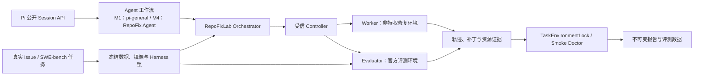

# RepoFixLab

基于真实 GitHub Issue 的容器化代码修复智能体与可信评测平台。

RepoFixLab 关注的不是“Agent 能否生成一段看起来合理的代码”，而是一个可复核的工程问题：在相同模型、任务环境和预算约束下，结构化代码修复流程能否稳定解决真实软件问题，并同时证明结果的正确性、安全性、成本和可复现性。

当前仓库已经完成 M0 环境与评测基座，状态为 **GO**。RepoFix Agent、M1 纵向切片和大规模 SWE-bench 实验仍在后续范围内。

- [M0 状态与完整事实](docs/status/repofixlab-m0-status.md)
- [M0 可移植证据包](docs/evidence/repofixlab-m0/)
- [系统设计规格](docs/designs/repofixlab.md)
- [M6 校准可靠性与 Token 成本复盘](docs/designs/repofixlab-m6-calibration-postmortem.md)

## 为什么做 RepoFixLab

真实代码修复评测容易受到四类问题影响：

1. **择优展示与信息泄露**：只展示成功样本、让 Agent 接触评测实现或在同一环境中反复试探，会放大表面通过率。
2. **指标单一**：只统计补丁是否通过，无法描述耗时、资源消耗、失败轨迹、安全事件和重复运行稳定性。
3. **环境不可控**：Agent 直接操作宿主机时，文件、进程、网络、凭据和依赖状态难以隔离，也难以复位。
4. **效果无法归因**：没有固定数据、镜像、Harness 和公平基线时，无法判断改进来自工作流、上下文、工具还是模型本身。

RepoFixLab 以冻结输入、容器化角色、只写一次的锁、官方 Harness 等价性验证、逐项证据绑定和失败样本保留来建立可信评测边界。M0 先证明“环境和裁判可信”；Agent 能力与对照/消融实验在后续阶段进入同一基座。

## 与 Pi 的关系

RepoFixLab 是对 [Pi](https://github.com/earendil-works/pi) 的工程扩展，不是另写一套 Agent runtime，也不修改 Pi 的核心 agent loop。

后续 RepoFix Agent 将通过 `@earendil-works/pi-coding-agent` 的公开 session API 组织上下文、工具和模型调用。Pi 继续负责通用 Agent 循环与会话能力；RepoFixLab 负责代码修复工作流、Docker 控制面、任务环境、官方评测、指标和证据发布。两者的边界可独立测试，也便于与原始 Pi 流程进行公平对照和消融。

## 架构



只有 Controller 持有 Docker socket。Worker 与 Evaluator 均由 Controller 根据受信候选目录中的固定策略创建，调用方不能提交镜像、命令、挂载、网络或 capability 参数。

## M0 GO

M0 使用冻结的 `SWE-bench/SWE-bench_Multilingual` 数据修订和 Axios `axios__axios-5892` 纵向切片，完成了从输入锁到最终 Smoke Doctor 的正式证据链。

| 项目 | 已验证结果 |
| --- | --- |
| 数据集 | 43 个真实任务，覆盖 7 个仓库；M0 当前只执行 Axios 单任务切片 |
| Harness 等价性 | pristine/adapted × base/no-op/malformed/gold，8/8 PASS |
| Worker/Evaluator 工厂探针 | 真实容器主动探测 PASS，严格执行 `worker → evaluator`，清理残留为 0 |
| TaskEnvironmentLock | 固定数据、镜像、资源、安全策略、Factory 与 Harness 证据，原子发布 PASS |
| Smoke Doctor | 全部检查组 PASS，20 个输入文件及真实路径互不重复 |
| TypeScript/Vitest | 12 个显式测试文件，150/150 PASS |
| Python Controller | 27/27 PASS |
| 根工程检查 | `npm run check` PASS，Biome 检查 802 个文件且未产生修改 |
| Docker 残留 | 临时、Factory、Bootstrap、CI 容器与卷均为 0；仅保留健康 Controller |

精确镜像 ID、报告路径、语义 hash、文件 hash、失败尝试和发布权限见 [M0 状态文档](docs/status/repofixlab-m0-status.md)。可移植副本与校验清单见 [M0 证据包](docs/evidence/repofixlab-m0/)。

## M0 的安全与可信边界

- Controller 使用只读根文件系统、`cap_drop=ALL`、`no-new-privileges`、internal control network，并且不发布宿主机端口。
- Docker Desktop socket 来源只接受 `/var/run/docker.sock` 或 `/run/host-services/docker.proxy.sock` 两个精确值之一；目标固定为 `/var/run/docker.sock` 且必须为读写挂载。
- Worker 与 Evaluator 使用 `network=none`、只读根文件系统、固定 CPU/内存/PID 限制、独立任务卷，并且没有 Docker socket 或敏感环境变量。
- 原始 `0600` 证据不会为了方便评测而放宽权限；受限身份创建逐字节 `0444` 副本，并复核大小和 SHA-256。
- TaskEnvironmentLock 与 Smoke 采用 `0707` 唯一空目录、root 原子发布、owner 封存为 `0555`、root 只读复核的协议。
- 失败 provenance、失败发布和失败 Smoke 全部保留，不能被改写或升级为最终通过结果。

Docker socket 等价于 Docker daemon root 权限，因此 Controller 是受信控制面。`read_only`、capability 限制和 `no-new-privileges` 不被表述为对该 daemon 权限的隔离。

## M0 没有证明什么

M0 没有声称 RepoFix Agent 已实现，也没有给出代码修复成功率、Token 成本、时延或稳定性结论。以下内容尚未完成：

- RepoFix Agent 的定位、规划、补丁生成、受控验证与迭代逻辑；
- 原始 Pi 对照与工作流消融实验；
- 多任务、多仓库和重复运行的统计评测；
- 预算控制、失败分类、成本分析和最终可视化报告；
- M1 纵向切片及后续 `formal` 生命周期。

## M1 纵向切片

M1 不实现完整 RepoFix 状态机，而是先完成第一条可展示、可验收的端到端链路：

```text
pi-general → candidate.patch → fresh Evaluator → result.json / events.jsonl / report.html
```

M1 的强制退出门是：一条 Compose 命令贯通 manifest、Agent、补丁、全新 Evaluator 和报告；无论模型成功修复还是失败，都必须产生包含官方结果、Token、耗时和失败原因的完整终态制品。

## 总体目标工作流（M4）

完整 RepoFix Agent 状态机属于 M4 目标。它将在 Pi 公开 API 上实现，不创建另一套 agent loop：

```text
UNDERSTAND
  → LOCALIZE
  → PLAN
  → PATCH_P0
  → CONTROLLED_VERIFY
  → REFINE
  → PATCH_P1
  → OFFICIAL_EVALUATE
  → REPORT
```

`CONTROLLED_VERIFY` 为 Agent 可见的受控反馈；`OFFICIAL_EVALUATE` 使用隔离的官方评测边界。后续实验首先进行原始 Pi 对照与工作流消融，再决定是否扩展到更大的 SWE-bench 任务集合。

## Docker 快速开始

### 前置条件

- Docker Desktop 使用 Linux containers；
- `linux/amd64`；
- 至少 8 CPU、16 GiB Docker VM 内存，并为 artifacts 与 Docker managed volumes 各保留约 120 GB 可用空间；
- Node.js 与 npm；Windows 主机执行正式包装器时需要 PowerShell。

先检查 Docker 资源并安装依赖：

```powershell
docker info --format "Memory={{.MemTotal}} CPUs={{.NCPU}} OS={{.OSType}} Arch={{.Architecture}}"
npm ci --ignore-scripts
npm run check
```

收集固定构建输入并构建 Controller/Orchestrator 镜像：

```powershell
powershell -NoProfile -ExecutionPolicy Bypass -File .\scripts\repofixlab.ps1 images lock-input
```

该命令只生成唯一的、未批准的 provenance candidate，不会静默替换 active lock。审计 candidate 并按 [RepoFixLab 包说明](packages/repofixlab/README.md)完成只写一次的 provenance 发布后，启动已构建且已锁定的控制面：

```powershell
docker compose up -d --force-recreate --no-build controller
docker compose ps
docker compose run --rm --no-deps --pull never orchestrator doctor --profile bootstrap --output m0/bootstrap-doctor-<unique-id>.json
```

不要复用已有输出路径。正式 TaskEnvironmentLock 和 Smoke 还要求已封存的数据、任务镜像、Harness 探针及唯一发布目录；完整的已验证输入和结果可从 [M0 证据包](docs/evidence/repofixlab-m0/)核对。

## 目录结构

```text
compose.yaml                         Docker 服务、网络与卷边界
scripts/repofixlab.ps1              主机侧受控构建与数据生命周期入口
packages/repofixlab/
  controller/                       受信 Docker 控制面（Python）
  src/                              Orchestrator、Doctor、锁与 TypeScript 合约
  schemas/v1/                       跨语言 JSON Schema
  task-images/                      Axios 固定任务镜像、审计与探针
  test/                             RepoFixLab TypeScript 回归测试
docs/designs/repofixlab.md          系统设计规格
docs/status/repofixlab-m0-status.md M0 当前事实与边界
docs/evidence/repofixlab-m0/        可移植 M0 证据索引与校验清单
artifacts/                          运行生成的锁、报告、失败记录与证据
packages/agent, ai, coding-agent    上游 Pi runtime 与公开 API
```

## 上游与许可证

RepoFixLab 基于 [earendil-works/pi](https://github.com/earendil-works/pi) 的 MIT 开源代码构建，并保留 Pi 原有包、历史和贡献者归属。Pi 提供通用 Agent runtime、模型接口、coding-agent session API 与终端能力；RepoFixLab 的新增部分聚焦真实代码修复工作流和可信评测基础设施。

本仓库按 [MIT License](LICENSE) 发布。上游 Pi 的商标、项目名称和贡献归其各自权利人与贡献者所有。
