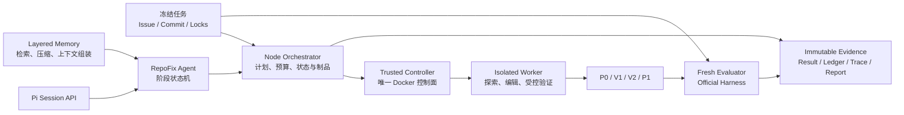

# RepoFixLab

基于真实 GitHub Issue 的代码修复 Agent 与可信评测平台。

RepoFixLab 构建在 [Pi](https://github.com/earendil-works/pi) 的公开 Session API 之上，将阶段化修复、分层记忆、受控验证、Docker 隔离和不可变实验制品整合为一条可复现的代码修复流水线。每个任务从冻结的 Issue、提交和环境开始，最终交付补丁、官方评测、完整轨迹、Token 账本与安全审计。

## 实验结果

在冻结的 26 个 SWE-bench Multilingual JavaScript/TypeScript 任务上，按每个任务最新有效官方评测制品汇总：

| 指标 | 结果 |
| --- | ---: |
| 官方解决任务 | **24/26（92.31%）** |
| Fail-to-Pass | **30/32（93.75%）** |
| Pass-to-Pass | **592/592（100%）** |
| 安全审计轨迹 | **74** |
| Controller 拦截的受限操作 | **148** |
| 未阻断的越界执行 | **0** |
| Patch policy violation | **0** |

所有结果均绑定运行身份、补丁 SHA-256、官方 Evaluator 输出和来源批次。完整口径与证据入口见 [实验结果摘要](docs/reports/repofixlab-experiment-summary.md) 和 [R2 修复复盘](docs/designs/repofixlab-r2-remediation-postmortem.md)。

## 系统架构



## RepoFix 工作流

```text
UNDERSTAND
  → LOCALIZE
  → PLAN
  → IMPLEMENT ── P0
  → controlled verification V0
  → REFINE_1 ── V1
  → controlled verification V1
  → REFINE_2 ── V2
  → controlled verification V2
  → SELF_REVIEW ── P1
  → fresh official evaluation
```

每个阶段通过严格 Schema 交接。PLAN 中的修改义务和行为不变量必须在 IMPLEMENT 与 SELF_REVIEW 中逐项处置；结构错误进入有限的 completion-only 修正流程。阶段状态机、模型轮次、Token、Provider 超时和墙钟时间共同构成确定性运行边界。

## 核心能力

### 阶段化代码修复 Agent

- 将开放式修复过程拆为七个职责明确的阶段。
- 使用结构化 handoff 保留定位候选、计划义务、验证反馈和风险处置。
- 保存 P0、V1、V2、P1 四份补丁快照，完整记录每次修订。
- 将协议错误、环境错误、验证失败和补丁语义失败分别记录。

### Controller-owned 受控验证

- Controller 从冻结的 `package.json` 生成可执行验证目录，模型只选择候选 ID。
- 每轮验证使用独立 baseline clone 和 candidate clone，输出结构化比较结果。
- 命令、工作目录、超时、缓存和构建前置步骤由 Controller 固定。
- 最终结果由 Fresh Evaluator 使用官方 Harness 独立裁决。

### 分层记忆与上下文组装

| 层级 | 内容 | 作用 |
| --- | --- | --- |
| L0 工作记忆 | 当前请求的 checkpoint 或 delta | 直接进入 Provider messages |
| L1 交接记忆 | 全部阶段 handoff 与证据引用 | 跨阶段稳定传递结论 |
| L2 任务长期记忆 | 原始消息、reasoning、工具返回、文件、补丁与验证 | 按 query 和引用受控取回 |

记忆系统压缩的是上下文视图，完整原始证据持续保存在 L2。大文件按结构和行范围分块；文件证据绑定 `path_revision` 与完整文件 SHA-256；成功编辑后可本地重建完整文件视图或迁移未受影响的 chunks。普通请求只追加 delta，压缩或 revision 变化时生成新 checkpoint，兼顾证据连续性、上下文容量和 Provider 前缀缓存。

### 隔离与安全控制

- 模型凭据只进入短生命周期 Orchestrator runner。
- Docker socket 只挂载到受信 Controller。
- Worker 与 Evaluator 使用 `network=none`、只读根文件系统、`cap_drop=ALL` 和固定资源配额。
- Agent 无法指定镜像、挂载、网络、capability、宿主路径或任意 shell。
- Worker 与 Evaluator 使用独立临时卷；正式评测在 Worker 销毁后启动。
- 路径穿越、符号链接逃逸、测试文件修改和越界执行由 Controller 拒绝并写入审计。

### 可复现证据链

每次运行保存：

- 冻结任务、环境、模型、Prompt、工具 Schema 与实验计划哈希；
- 完整 Agent 轨迹、阶段 handoff、补丁快照与验证记录；
- Provider usage、缓存、reasoning、Token reservation 与耗时；
- Worker/Evaluator 身份、镜像、资源、清理和安全证据；
- 官方 F2P/P2P 结果、终态分类与静态 HTML 报告。

跨语言契约以 TypeBox 为源，生成的 JSON Schema 同时由 Node Orchestrator 和 Python Controller 校验。运行制品采用 canonical JSON、SHA-256、原子发布和只追加 journal。

## 本地运行

环境要求：Docker Desktop Linux containers、Node.js 22.19+、PowerShell。

```powershell
npm ci --ignore-scripts
npm --prefix packages/repofixlab run build

# 准备冻结数据
.\scripts\repofixlab.ps1 dataset prepare --config configs/dataset/v1.yaml

# 构建并锁定任务镜像与运行输入
.\scripts\repofixlab.ps1 images lock-input

# 执行容器安全探针
.\scripts\repofixlab-m2-security-probe.ps1

# 从冻结制品重建离线分析报告
.\scripts\repofixlab-m8.ps1
```

验证契约与测试：

```powershell
npm --prefix packages/repofixlab run check:schemas
npm --prefix packages/repofixlab test
```

## 项目结构

```text
packages/repofixlab/
  src/                 Agent、Orchestrator、Memory、契约、指标与报告
  controller/          Python Trusted Controller 与 Docker Runtime
  evaluator/           Official Harness 适配与独立评测内核
  configs/             冻结数据、运行环境和实验计划
  schemas/             跨语言 JSON Schema
  test/                Agent、Memory、评测、预算与安全回归
docs/designs/          系统设计、执行协议与工程复盘
docs/reports/          实验结果与正式复测报告
docs/guides/           本地复现指南
artifacts/             本地不可变运行制品
```

## 文档

- [RepoFixLab 系统设计](docs/designs/repofixlab.md)
- [RepoFix R2 执行契约](docs/designs/repofixlab-r2-execution-contract.md)
- [记忆系统设计](docs/resume/repofixlab-memory-system-design.md)
- [实验结果摘要](docs/reports/repofixlab-experiment-summary.md)
- [M8 离线复现指南](docs/guides/repofixlab-m8-reproduction.md)

## License

RepoFixLab 基于 [earendil-works/pi](https://github.com/earendil-works/pi) 的 MIT 代码与公开 API 构建，并以 [MIT License](LICENSE) 发布。
