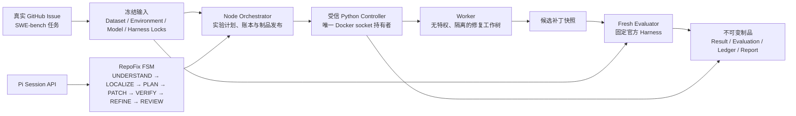

# RepoFixLab

基于真实 GitHub Issue 的容器化代码修复智能体与可信评测平台。

RepoFixLab 建立在 [Pi](https://github.com/earendil-works/pi) 的公开 session API 之上：Pi 提供通用 Agent 运行时，RepoFixLab 负责将真实代码修复任务组织为受控工作流，并将修复结果交给独立、全新的官方评测环境裁决。项目关注的不是“能否生成一段看起来合理的补丁”，而是能否在冻结的任务、环境、模型和预算条件下，留下可复核的修复、回归、安全和资源证据。

当前实现覆盖冻结任务准备、Docker 隔离执行、RepoFix 阶段化工作流、官方 Evaluator、实验账本和离线分析。任务接入目前是受控的实验清单/命令行入口；尚未提供把任意 GitHub URL 直接提交给平台执行的公网触发层。

## 架构



职责边界如下：

- **Orchestrator**：固定运行身份、预算、实验矩阵和证据发布，不直接给予 Agent Docker 权限。
- **RepoFix Agent**：以 Pi session 为运行底座，按阶段产出定位、计划、补丁、自审和修订决策。
- **Controller**：唯一可访问 Docker daemon 的受信控制面；调用方不能自定义镜像、命令、挂载、网络或 capability。
- **Worker**：仅用于仓库探索和候选补丁，使用受限文件系统、网络和资源配额。
- **Evaluator**：在 Worker 销毁后重新创建；只接收最终补丁快照，以固定官方 Harness 执行 F2P/P2P。

## 工作流

```text
冻结任务清单
  → 预检并绑定 DatasetLock / TaskEnvironmentLock / 模型与预算
  → Pi Session 启动 RepoFix FSM
  → UNDERSTAND / LOCALIZE / PLAN
  → PATCH_P0 → Controller-owned controlled verification (V0)
  → REFINE_1 → PATCH_V1 → verification (V1)
  → REFINE_2 → PATCH_V2 → verification (V2)
  → SELF_REVIEW → PATCH_P1
  → 销毁 Worker，创建新的官方 Evaluator
  → F2P、P2P、Token、耗时、安全事件写入不可变报告
```

受控验证不是让模型执行任意 shell 命令：Controller 从冻结 `package.json` 预检得到候选测试目录，模型只选择候选 ID。私有 F2P/P2P 定义、官方日志和 Harness 不暴露给 Agent；通用回归通过也不能替代官方验收。

## 输入与输出示例

下面是一次正式任务的简化输入。真实运行还会绑定哈希、镜像、Harness 和预算账本；这些字段由实验计划生成，而不是由外部调用者自由传入。

```json
{
  "instance_id": "preactjs__preact-3454",
  "source": "SWE-bench Multilingual / GitHub Issue",
  "base_commit": "<frozen commit>",
  "configuration": "repofix-full",
  "max_model_turns": 128,
  "task_environment_lock": "<sha256-bound lock>"
}
```

一次完成的输出不是只有 `patch.diff`，而是一组可追溯制品：

```json
{
  "run_id": "run-...",
  "terminal_status": "completed",
  "resolved": true,
  "candidate_patch": "patch snapshot sha256",
  "official_evaluation": {
    "fail_to_pass": "passed/total",
    "pass_to_pass": "passed/total"
  },
  "usage": {
    "accounted_tokens": 0,
    "model_turns": 0,
    "wall_time_ms": 0
  },
  "evidence": ["trajectory", "verification records", "evaluator result", "token ledger"]
}
```

其中 `resolved` 仅在全部 F2P 通过且没有 P2P 回归时成立。数值 `0` 仅表示示意；正式结果使用实际 Provider 账本和官方 Evaluator 制品。

## 已完成实验与报告

完整结果与口径见 [实验结果摘要](docs/reports/repofixlab-experiment-summary.md)。核心结论分为两类，不能混为单一的同质对照：

| 视图 | 任务成功率 | F2P | P2P | 说明 |
| --- | ---: | ---: | ---: | --- |
| Pi-general，M9 26 任务首次结果 | 21/26（80.77%） | 29/32（90.63%） | 587/592（99.16%） | 每个冻结任务仅选择一条 Pi 官方结果；64-turn 结果保留原轮次标签。 |
| RepoFix，R2 最新替换视图 | 24/26（92.31%） | 30/32（93.75%） | 592/592（100%） | R3、恢复批次、R9/R12 和携带制品组成的 provenance-labelled composite，不是重新执行的单一同质批次。 |

因此，R2 的 24/26 说明阶段化工作流经定向修复后的当前官方结果；它不能被表述为对 Pi 21/26 的一次固定预算、同批次显著性胜出。冻结 M7/M8 的 74 条逻辑运行仍按 64/128 turns 分层分析，且保留失败与无最终快照样本。

- [M7 continuation 协议](docs/designs/repofixlab-m7-protocol-1.7.md)
- [M8 离线分析契约](docs/designs/repofixlab-m8-analysis.md)
- [M9 26 任务复用与完成协议](docs/designs/repofixlab-m9-reuse-protocol.md)
- [R2 阶段化修复复盘](docs/designs/repofixlab-r2-remediation-postmortem.md)
- [R2 执行契约](docs/designs/repofixlab-r2-execution-contract.md)

## 本地运行

前提：Docker Desktop 使用 Linux containers，已准备冻结数据/环境制品，并按实验计划配置模型凭据。不要将凭据写入制品或传给 Controller、Worker、Evaluator。

```powershell
npm ci --ignore-scripts
npm run check

# 构建并执行受控的锁定输入流程
powershell -NoProfile -ExecutionPolicy Bypass -File .\scripts\repofixlab.ps1 images lock-input

# 启动受信 Controller 并运行 Bootstrap Doctor
docker compose up -d --force-recreate --no-build controller
docker compose run --rm --no-deps --pull never orchestrator doctor --profile bootstrap --output m0/bootstrap-doctor-<unique-id>.json
```

正式实验必须使用已冻结的计划和唯一输出目录；失败运行同样需要保留终态证据，不能通过覆盖、静默重试或替换任务改善结果。

## 项目结构

```text
packages/repofixlab/
  src/                 Node Orchestrator、RepoFix FSM、契约与报告
  controller/          受信 Python Controller
  evaluator/           官方评测适配与规范化
  configs/             冻结实验计划
  test/                工作流、评测、账本与安全回归测试
docs/designs/          设计、协议、复盘与实验边界
docs/reports/          面向阅读者的实验结果摘要
artifacts/             本地不可变运行制品（通常不提交 Git）
.pi/skills/            项目内 Pi 技能
```

## 许可与上游

RepoFixLab 基于 [earendil-works/pi](https://github.com/earendil-works/pi) 的 MIT 代码和公开 API 扩展而来，不修改 Pi 的核心 agent loop。Pi 提供通用 Agent runtime；RepoFixLab 新增的是修复工作流、容器控制面、可信评测和实验报告能力。仓库按 [MIT License](LICENSE) 发布。
