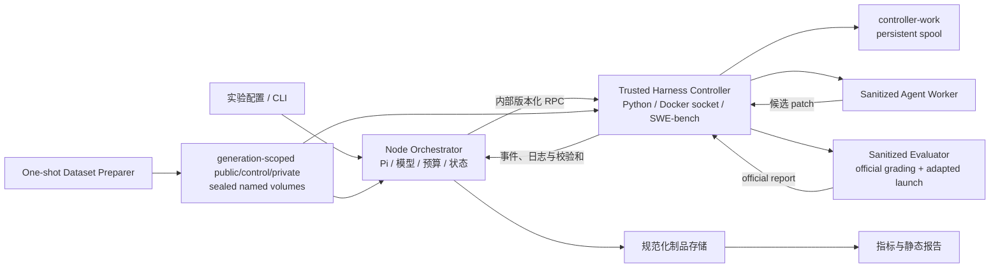
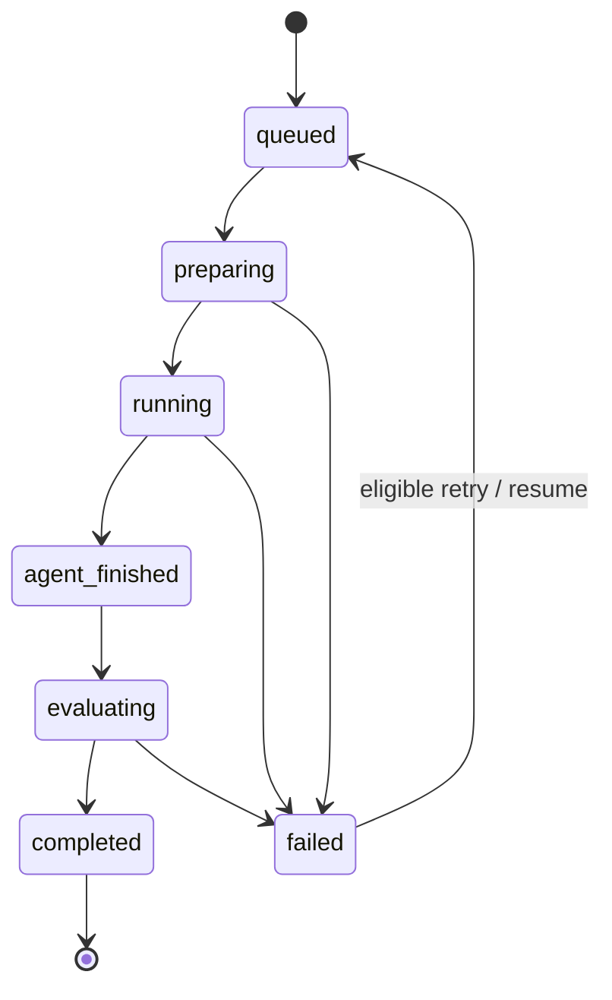

# RepoFixLab 设计规格

| 属性 | 值 |
| --- | --- |
| 状态 | 已确认，进入实现阶段 |
| 版本 | 1.3 |
| 更新日期 | 2026-07-18 |
| 产品名称 | RepoFixLab——容器化代码修复智能体与可信评测平台 |
| 实现底座 | Pi SDK、Docker Desktop（WSL2/Linux containers）、SWE-bench |

## 1. 摘要

RepoFixLab 面向代码智能体研发与仓库维护场景，提供从真实 GitHub Issue 修复、隔离执行、隐藏测试判定，到成本、耗时、稳定性和失败轨迹分析的一体化流程。

首期不把项目叙事建立在“改造 Pi”上。Pi 是可替换的智能体运行时与通用工作流基线；对外要回答的问题是：

> 在固定模型、任务环境和最大预算下，结构化代码修复流程能否比通用代码智能体更可靠地解决真实 GitHub Issue，并量化其正确性、成本、耗时、稳定性和安全性？

项目采用 SWE-bench Multilingual 中全部 43 个 JavaScript/TypeScript 任务，使用 Docker 隔离代码执行，使用运行时不可见的官方测试判定候选补丁，并比较通用 Pi 工作流、完整 RepoFix 工作流以及两组消融配置。所有正式实验保留配置、轨迹、补丁、测试日志与资源消耗，最终生成可追溯的静态报告。

本项目的成功不以“RepoFix 必须优于基线”为前提。系统能够在受控条件下复现实验、如实拒绝假设并解释失败，才是评测平台的核心价值。

## 2. 项目定位

### 2.1 对外定位

RepoFixLab 是“代码修复智能体 + 可信评测基础设施”，而不是 Pi 的功能展示页，也不是只展示几个成功案例的自动改代码 Demo。

它服务于三个具体场景：

1. **Agent 研发回归**：修改提示词、工具或工作流后，用固定任务集判断正确率、成本和失败类型是否发生退化。
2. **方案选型与归因**：在相同模型和预算下比较通用工作流与结构化修复流程，并通过消融定位收益来源。
3. **仓库 Issue 辅助修复**：对真实 Issue 生成候选补丁、测试证据和完整轨迹，交由工程师审查后进入现有 PR 流程。

首期以离线评测和单机批处理为核心。生产仓库接入属于同一架构的应用延伸，但不作为首期交付前提。

### 2.2 名称与术语

| 名称 | 含义 |
| --- | --- |
| RepoFixLab | 对外产品名与整体平台 |
| RepoFix Agent | 面向仓库级 Issue 的结构化修复工作流 |
| Pi SDK | 智能体循环、模型调用、会话和工具调用底座 |
| Pi General Baseline | 保留 Pi 通用编码工作流、不启用 RepoFix 专用阶段的对照配置 |
| Agent Worker | 供智能体读写代码和运行开发命令的隔离容器 |
| Evaluator | 在第二个干净容器中运行官方测试的判定组件 |
| 运行时隐藏测试 | 正式运行时不向 Agent 暴露的 `test_patch`；不代表其从未公开或模型训练中绝对不可见 |

公开材料应优先使用“通用代码智能体基线”这一表述；Pi 只在技术架构和实验配置中说明。

## 3. 问题与动机

### 3.1 成功案例不能证明工程能力

一次修复成功可能来自偶然采样、已见过的公开任务、人工挑选样本或宽松测试。只展示成功轨迹无法回答失败率、复现率、成本和回归风险，也无法判断系统是否能长期运行。

RepoFixLab 因此固定任务清单与实验协议，保留全部结果，正式运行中不允许人工修改补丁或删除失败样本。

### 3.2 单一通过率无法指导 Agent 迭代

官方测试通过仍是首要正确性标准，但它不能解释失败发生在仓库定位、方案制定、代码修改、自测、环境准备还是资源耗尽。工程决策还需要模型成本、耗时、工具调用、重复运行稳定性、基础设施故障与安全事件。

RepoFixLab 将“最终结果”和“过程证据”同时记录，使失败可定位、优化可归因。

### 3.3 代码执行需要明确隔离边界

Pi 默认继承宿主进程权限，项目信任机制不是沙箱。代码智能体还会主动读取文件、写入代码、安装依赖和执行命令，直接在宿主机批量运行不适合作为无人值守评测方案。

RepoFixLab 将逻辑控制面拆成两个可信容器：Node Orchestrator 负责 Pi、模型调用、预算、状态机和实验调度，Trusted Harness Controller 是唯一持有 Docker socket 的物理容器控制者。仓库操作被路由到无凭据、受限资源的 Agent Worker；候选补丁再进入独立、干净的 Evaluator。Docker 是本项目的风险降低措施，不被描述为绝对安全边界。

### 3.4 公开基准有污染和任务质量限制

公开 GitHub Issue、参考补丁和测试可能进入模型训练数据；测试也可能过窄、过宽、覆盖不足或与任务描述不一致。因此，RepoFixLab 首期只声称比较“同一模型在固定公开任务集上的工作流差异”，不把分数解释为模型绝对软件工程能力。

同模型对照能减少模型能力差异，但不能消除训练污染。完整的数据质量审计和时间隔离的新任务集列为后续工作。

## 4. 目标与非目标

### 4.1 首期目标

1. 基于 Pi SDK 实现可配置的 RepoFix 结构化修复工作流。
2. 在 Docker Desktop 的 Linux 容器中隔离仓库操作与测试执行。
3. 导入并冻结 SWE-bench Multilingual JavaScript/TypeScript 任务清单。
4. 在同模型、同预算、同工具接口和同环境下完成基线、完整方案与两组消融实验。
5. 建立自建评测体系，覆盖正确性、效率、稳定性、安全性和可复现性。
6. 保存每次运行的配置、事件轨迹、候选补丁、测试日志、成本与终止原因。
7. 生成适合项目演示、结果审计和面试讲解的静态 HTML/JSON 报告。
8. 支持批量运行、失败重试、断点续跑和结果汇总。

### 4.2 首期非目标

- 不比较 mini-SWE-agent、SWE-agent 等外部 Agent；作为项目完成后的后续实验。
- 不做多模型路由、模型排行榜或跨模型能力比较。
- 不做多 Agent 协作。
- 不自动从 GitHub 挖掘和标注新任务。
- 不建设在线多用户 SaaS、权限系统或任务队列集群。
- 不大范围修改 Pi 核心包；优先新增独立包并通过公开 SDK/扩展点接入。
- 不重新设计 Pi 现有前端或 TUI 风格。
- 不声称消除训练数据污染、证明所有补丁的语义正确性或提供绝对安全沙箱。
- 不把 LLM-as-a-Judge 作为正确性主判据。

## 5. 研究问题与假设

### 5.1 主研究问题

在模型、采样参数、最大 Token、最长运行时间、工具接口、容器资源和任务集合均固定时，RepoFix 的结构化工作流是否比通用 Pi 工作流产生更高的端到端修复率？

### 5.2 次级问题

- 明确的仓库定位阶段是否减少无效搜索并提高修复率？
- 自测—分析—修订闭环是否减少回归或无效补丁？
- 收益是否以显著增加成本、耗时或工具调用为代价？
- 相同任务重复运行时，成功结果是否稳定？
- 隔离、资源限制与审计控制是否通过预定义安全门禁？

### 5.3 可证伪假设

| 假设 | 预期验证方式 |
| --- | --- |
| H1：完整 RepoFix 产生有实际意义的修复率提升 | 30 个冻结测试任务上的配对 `ΔResolved Rate` |
| H2：显式仓库定位门控提高定位效率 | 移除强制定位阶段和定位产物；比较修复率、首次最终保留编辑前调用数和搜索调用数 |
| H3：向 Agent 返回测试反馈能减少未解决补丁与回归 | 屏蔽测试反馈但保留一次匹配的自审/修订机会；比较 F2P、P2P 与修订结果 |
| H4：平台满足受限执行要求 | 独立安全门禁和可审计的资源限制测试 |

任何假设未成立都必须保留并解释，不得以调整样本或只展示成功案例修正结论。

H1 的主效应预先定义为：

```text
ΔResolved Rate = Resolved Rate(repofix-full) - Resolved Rate(pi-general)
```

`+10` 个百分点（30 个任务中净增加至少 3 个成功）定义为最小实际意义阈值。点估计达到该阈值只表示“具有实际意义”；只有配对 95% 区间同时排除 0 才表述为“有统计支持”。其余结果按“方向为正但证据不足”“无实际差异”或“方向为负”报告，不能统一包装为提升。

## 6. 系统架构



### 6.1 信任边界

**Node Orchestrator**是调度、模型 API、预算、工作流状态和规范化制品的唯一 owner。模型凭据仅存在于该容器；它不挂 Docker socket，也不直接管理容器。

**Trusted Harness Controller**是唯一挂载 Docker socket、唯一管理 Worker/Evaluator 生命周期和执行官方 Python harness 的服务。它不持有模型凭据，不拥有独立任务队列、预算或重试策略，只接受无宿主公开端口的窄化版本化请求。由于 Docker socket 等价于 daemon 高权限，该服务属于可信控制面，不属于沙箱。

**Dataset Preparer**是只在数据准备阶段运行的一次性服务。它通过准备期专用网络下载固定 revision，写入带 staging ID 的 Docker managed public/control/private named volumes，校验记录数、逐文件 hash 和交叉引用后最后写 READY/SEAL 并发布 DatasetLock；不持有模型凭据或 Docker socket，完成后退出，正式实验不启动。封存 generation 只读，重新准备必须创建新 generation，不能原地改写。

**Agent Worker**只包含净化后的 base tree、开发工具和受限工作目录。它不能访问宿主源码目录、模型凭据、Docker socket、gold patch、`test_patch`、未来 Git 对象或其他任务制品。

**Evaluator**从固定 official digest 派生的净化镜像开始，只接收候选 patch 和当前任务的 evaluator 专用测试数据。它保留 base commit 及其可达历史但删除未来 refs/tag/reflog/unreachable objects，不复用 Agent Worker 的文件系统。为兼容固定上游 harness，Evaluator 可在容器内以 root 执行，但仍必须禁网、丢弃 capabilities、禁止提权并受资源限制。

**制品存储**由 Orchestrator 规范化写入；Controller 使用独占的 `controller-work` persistent volume 保存 operation journal、lease 和原始日志，通过结构化事件和带哈希的原始制品流返回结果。Orchestrator fsync ArtifactIndex 并 ACK 后 Controller 才能清理 spool；Agent Worker 不直接挂载。模型交互事件、补丁、日志和指标按实验与运行编号组织。

### 6.2 建议代码边界

首期实现建议作为独立工作区包落在 `packages/repofixlab/`，逻辑模块如下：

```text
packages/repofixlab/
  src/
    agent/          # 基线与 RepoFix 工作流
    sandbox/        # Docker 生命周期和容器工具网关
    dataset/        # SWE-bench 导入、校验、冻结清单
    runner/         # 批处理、预算、重试、断点续跑
    evaluator/      # 官方测试适配与结果规范化
    metrics/        # 指标计算、统计与失败分类
    report/         # 静态报告生成
  controller/       # Python 3.11 Trusted Harness Controller 与固定 security patch
  docker/           # Orchestrator、Dataset Preparer、Controller 与 sanitizer 镜像
  schemas/          # TS/Python 共用的版本化 JSON Schema
  configs/          # 版本化实验配置
  test/             # 单元、集成与安全门禁测试
```

数据集缓存、镜像层和实验结果不提交到 Git；只提交清单、配置、schema、可复现实验说明和小型报告样例。

### 6.3 Pi SDK 接入决策

首期使用 `@earendil-works/pi-coding-agent` 的 `createAgentSession()` 作为会话入口，而不是复制 Agent loop。评测会话通过 `noTools: "builtin"` 禁用宿主内建工具，同时用 `tools: ALL_CUSTOM_TOOL_NAMES` 建立不可扩大的 allowlist，只注册容器工具网关提供的 `customTools`。

会话为每个 attempt 使用空的隔离 `agentDir`、attempt 专属 SessionManager 和显式 ResourceLoader，并设置 `noExtensions`、`noSkills`、`noPromptTemplates`、`noThemes`、`noContextFiles`。Loader 只返回版本化的系统提示和工具说明；任务输入由 Runner 显式发送。不得自动发现宿主或任务仓库中的全局/项目扩展、skills、prompt、`.pi` 配置、`AGENTS.md` 或 `CLAUDE.md`，也不得从用户默认 Pi 目录读取设置。仓库文件仍可由受限工具按需读取，但不会在会话启动时隐式注入。每个配置同时记录 Pi commit、最终渲染的 system prompt 哈希和工具 schema 哈希，使基线含义可复核。

每个 task × config × replicate × attempt_id 使用新的 Pi session；同一 attempt 内的 RepoFix 阶段复用该 session，基础设施重试的新 attempt 不继承失败轨迹。只有 session、容器、阶段快照、trace/ledger offset 全部一致且无 in-flight 调用或未结 reservation 的 quiescent checkpoint 才可恢复原 attempt。Runner 同时使用 immutable custom-tool allowlist、显式阶段子集校验和串行执行。stage_complete 必须独占 tool-call batch，混合批次在工具执行前整体阻止。预算通过包装公开的 streamFn 和最终 payload/usage 接口实现，覆盖普通 turn 与自动 compaction/summary。普通 provider/session retry 关闭；只有 provider probe 已证明 request-level `verified_not_billed` 的 context overflow 才允许 Pi 在同一 attempt compact+continue，并完整记录轮次、耗时和后续模型用量。计费状态不明的 overflow 在适配层转成非 overflow 错误，阻止自动 continue、全额 reservation charge并暂停对账。首期不修改 Agent loop；只有适配层经过契约测试证明无法满足门禁时，才另行提出最小 SDK 透传设计，不直接修改循环算法。

## 7. RepoFix Agent 工作流

### 7.1 标准流程与职责边界

RepoFix Agent 内部包含七个工作阶段：

1. **`UNDERSTAND` / 任务理解**：提取期望行为、约束、复现线索和验收条件，形成结构化任务摘要。
2. **`LOCALIZE` / 仓库定位**：检查仓库结构，搜索相关符号、调用链、测试和历史约定，输出候选文件及证据。
3. **`PLAN` / 修复计划**：提出最小修改方案、潜在回归点与拟运行测试；计划在首次编辑前落盘到轨迹。
4. **`IMPLEMENT` / 代码修改**：通过容器作用域工具编辑干净工作区，避免无关重构；完成后由 Runner 冻结初始候选快照 `P0`。
5. **`CONTROLLED_VERIFY` / 受控验证**：Runner 在模型工具之外运行计划中的定向测试，并按实验配置返回或屏蔽测试反馈。
6. **`REFINE` / 反馈修订**：在固定机会和预算内修订 `P0`；记录使用的反馈、修改理由和结果。
7. **`SELF_REVIEW` / 补丁自审**：检查 diff、意外文件、调试代码、测试绕过和改动范围；完成必要的最终修正后，由 Runner 冻结最终候选快照 `P1`，RepoFix Agent 到此结束。

RepoFixLab 平台在 Agent 结束后执行两个后处理阶段：

1. **`OFFICIAL_EVALUATE` / 官方判定**：独立 Evaluator 在干净容器中只评测 `P1`，运行 Agent 不可见的官方测试。
2. **`REPORT` / 结果报告**：聚合正确性、成本、耗时、稳定性、安全事件和轨迹制品。

```text
RepoFix Agent:
UNDERSTAND → LOCALIZE → PLAN → IMPLEMENT → [P0]
→ CONTROLLED_VERIFY → REFINE → SELF_REVIEW → [P1]

RepoFixLab Platform:
[P1] → OFFICIAL_EVALUATE → REPORT
```

`P0` 和 `P1` 是不可变补丁快照及阶段检查点，不是模型推理动作。官方判定和报告属于平台控制面，不得描述成 Agent 自己验证并宣告成功。

### 7.2 Runner 强制的阶段边界

RepoFix 阶段不能只依赖提示词自觉遵守。Runner 维护阶段状态和工具白名单，并在受控验证前生成不可变的初始候选 `P0`：

1. 理解、定位和计划阶段允许读取、搜索和复现命令，不允许把工作区修改带入修复阶段；复现使用的临时写入在阶段切换时丢弃。
2. 修复阶段从干净工作区开始，允许读、搜、编辑并形成 `P0`；Runner 将其 patch 和工作区哈希冻结。
3. Runner 在模型工具之外执行一次计划中的定向测试并保存完整日志。
4. `repofix-full` 获得规范化测试反馈；`repofix-no-verify-feedback` 只获得“验证已执行、反馈被屏蔽”的中性事件。
5. 两组都获得一次相同的 `REFINE` 机会。此阶段关闭 shell/命令工具，只允许读、diff 和编辑，防止消融组自行重跑测试绕过屏蔽。
6. 两组进入显式 `SELF_REVIEW`，检查补丁完整性、最小性和策略违规；必要的最终修正单独标记为 `self_review_fix`。
7. Runner 冻结最终候选 `P1`，RepoFix Agent 结束；独立 Evaluator 只评测 `P1`。`P0`、测试日志、自审记录和 `P1` 均保留供归因分析。

阶段切换、工具启停和快照由代码状态机执行，提示词只解释规则。通用基线不使用这些 RepoFix 阶段门；这是被比较工作流的一部分，而不是未记录的环境差异。

### 7.3 防止“假修复”的约束

- Agent 不得读取 `patch`、`test_patch`、F2P/P2P 预期列表或 evaluator 日志。
- Agent 不得修改评测器、任务清单或控制面制品。
- 正式运行禁用网络，避免在线搜索参考 PR 或补丁。
- 候选 patch 必须排除 `.git`、依赖缓存、构建产物和测试注入文件。
- 修改或删除测试不能直接带来通过；触及 Evaluator 管理的测试或 harness 路径默认记为 `policy_violation`，合法例外必须在冻结任务清单中预先声明。
- Evaluator 使用 Controller 固定的不可修改命令，并验证预期 F2P/P2P 确实被收集和执行；空测试、全跳过或修改测试发现配置不能判为通过。
- 测试命令的退出码、标准输出、持续时间和截断信息必须记录。

### 7.4 通用 Pi 基线的精确定义

`pi-general` 保留 Pi 的通用编码系统提示、自由探索方式和标准读写/搜索/命令能力，不加入 RepoFix 的结构化任务摘要、强制定位产物、阶段门或验证闭环。

为保证安全和公平，基线仍使用与 RepoFix 相同的容器工具网关、模型、预算、任务输入、重试策略和资源限制。因此它是“Pi 通用工作流基线”，不是未经任何适配、直接拥有宿主权限的原始二进制。报告必须明确这一点。

## 8. Docker 执行与安全设计

### 8.1 执行模式

- Docker Desktop 使用 WSL2 Linux container 后端。
- Pi SDK、模型客户端、预算和实验状态运行于固定 Node 24 digest 的 Orchestrator 容器；宿主不需要 Node/Python。
- Dataset Preparer 只在准备 profile 中获得数据源网络，写 generation-scoped public/control/private staging volumes并封存后退出；运行期 Orchestrator/Controller 只读所需 sealed volume，Orchestrator 永不挂载 private volume。
- Python 3.11 Trusted Harness Controller 是唯一挂载 Docker socket 的服务，也是唯一 Worker/Evaluator 生命周期 owner；Node Orchestrator、Worker 和 Evaluator 均不挂载 socket。
- Orchestrator 与 Controller 只在 Compose 内部网络通过版本化窄 RPC 通信；Controller 不发布宿主端口，不接受任意镜像、mount、network、capability 或 Docker 参数。
- Pi 内建的宿主 `read`、`write`、`edit`、`grep`、`find` 和 shell 工具在评测会话中禁用，由同名或等价的容器作用域工具替代。
- Agent Worker 与 Evaluator 都从固定 digest 的官方实例镜像派生并净化。Worker 删除原 `.git`，使用固定 author、timestamp、timezone、uid/gid 和文件时间创建唯一 baseline commit；Evaluator 保留原 base commit ID 及其可达历史，删除所有未来 refs/tag/reflog/unreachable objects。TaskEnvironmentLock 固定 source repository@digest、精确 worker/evaluator local image ID、sanitizer hash、platform 和 fs profile 的 provenance binding；formal 直接按 sanitized local image ID 启动，缺失时不得退回 source/tag 或静默重建。
- 每个 Worker 的全部工具调用按模型返回的 tool-call 顺序串行执行；命令与文件修改共享同一队列，避免并发写入造成非确定状态。
- Agent Worker 完成后只导出规范化 patch 和日志摘要，随后销毁。
- Evaluator 创建新容器并重新应用 patch；不复用 Agent Worker。

### 8.2 默认安全控制

以下数值是首轮 dev 校准目标；进入 validation 前必须冻结在实验配置中：

| 控制 | 默认目标 |
| --- | --- |
| 进程用户 | Orchestrator、Dataset Preparer、Worker 固定非 root；Controller 是显式可信 socket owner；Evaluator 兼容固定上游 `DOCKER_USER=root`，不得笼统声称全容器 non-root |
| Linux capabilities | `--cap-drop=ALL` |
| 提权 | `no-new-privileges` |
| 网络 | Worker/Evaluator 为 `none`；Orchestrator 连接 provider egress；Dataset Preparer 仅准备期连接 dataset egress；Controller 只有 internal control |
| Docker socket | 只挂载到可信 Controller；Orchestrator、Dataset Preparer、Worker、Evaluator 均不挂载 |
| 根文件系统 | Worker 只读根；Evaluator 使用经 43 任务预检冻结的只读根与任务级可写路径 profile，若不兼容则协议不得冻结 |
| CPU | 每个任务最多 4 vCPU |
| 内存 | 每个任务最多 8 GiB，无无限制 swap |
| PID | 固定上限，具体值经 dev 校准后冻结 |
| Agent 时限 | 每任务 30 分钟 |
| Evaluator 时限 | 每任务按官方配置设置独立硬超时 |
| 模型 token | 每个正式 run 累计最多 200k；输入、输出、缓存和推理 token 分项记录 |
| 模型成本 | 按版本化智谱 CNY 阶梯价格观测，不作为硬终止条件 |
| 模型轮次 | 每任务最多 50 轮 |
| 工具调用 | 每任务最多 100 次 |

Token、模型轮次、工具次数和时间限制同时启用，先到者终止。Runner 包装公开的 `session.agent.streamFn`，让普通 Agent turn、自动 compaction 和 summary 都进入同一账本。组合 SDK 原 `onPayload` 后，冻结 `reserved_input = ceil(pi_estimate(final_payload) × multiplier) + framing_margin` 的 provider-specific TokenAdmissionEstimator，再加 max output 形成 reservation；multiplier/margin 由 GLM smoke、Dev、Validation 的最大实测残差加安全余量确定。UTF-8 bytes 与 Pi estimate 都不宣称为 tokenizer 上界。request_id/reservation 先 fsync WAL 再允许 HTTP；余额不足返回契约内机器可分类 error stream。usage 完整时验证 `actual_prompt <= reserved_input` 和 `actual_total <= reservation`，违反即 budget_protocol_invalid、停止整个实验；usage 不完整按全 reservation 记账并暂停准入对账。原 streamFn 在返回 stream 前 reject 也转换为 provider_preflight_failure，只有能证明 HTTP 未发出才零 charge。wrapper 不等待 session/message_end、不执行工具或写 checkpoint；整个 prompt/工具批次成功并全部 flush 后才写 quiescent checkpoint。context-overflow 只有满足冻结的 request-level `verified_not_billed` 判据才不触发暂停并允许自动恢复；否则在 Pi 识别前映射为 provider_usage_unverified。允许恢复时，也只有 overflow 关闭记录先落账、最终 continue 成功且所有 offset flush 后才可 checkpoint。缓存与推理 token 是总量子集，不重复相加。

如果某个官方任务需要不同资源，必须通过任务清单中的显式覆盖字段配置；报告同时展示覆盖原因，不能在运行中临时放宽。

### 8.3 本机容量前置检查

在 JS/TS 子集完成实测前，doctor 采用官方 harness 的通用建议作为保守门槛：Linux/x86_64 容器、E 盘宿主与 Docker 数据文件系统内部都至少有 120,000,000,000 bytes 可用空间、Docker 可用 8 核 CPU 和 16 GiB 内存。建议将 E 盘余量清理到 150 GB；低于最低线时阻止批量镜像准备和正式实验，但不阻止代码开发。

doctor 分三层，避免生命周期循环依赖：`bootstrap` 在 dataset prepare 前运行，只检查 daemon、架构、宿主/Docker 内部空间、CPU/内存、控制网络、准备基础镜像，以及此时真实常驻的 Controller/Orchestrator；它不要求尚未进入生命周期的 Dataset Preparer、Worker 或 Evaluator 容器存在。`smoke` 在 Axios materialize 后验证单任务清单、真实 Worker/Evaluator 工厂探针与四探针；`formal` 必须等 M2 角色安全 profile 和 M3 的 43-task locks 完成后，在 M6 前验证全量门禁。宿主空间通过 Orchestrator 对容器 `/artifacts`（由仓库根目录的 `artifacts/` bind）执行 `statvfs` 测量；Docker 内部空间不能从 `docker info` 推断，必须由 Controller 用固定 digest 的一次性探针容器在 Docker managed named volume 上执行 `statvfs`，同时记录原始字节、Docker root、volume ID 和探针镜像 digest。

截至 2026-07-18，bootstrap 规范证据 `artifacts/m0/bootstrap-doctor-audited-v6.json` 为首次 `pass`。它确认 Docker Linux/amd64、12 CPU、`MemTotal=20,972,773,376` bytes、`/artifacts` 可用 `210,370,609,152` bytes、Docker managed volume 可用 `947,109,801,984` bytes；Controller socket=`read-write`、Orchestrator socket=`none`，Dataset Preparer、Worker、Evaluator 为 lifecycle=`deferred` 且容器观测值为 `null`。报告语义/文件 SHA-256 分别为 `5234eae6291a0f808ca2db885efffa56354b90c5467c7d590ed3276117ab4c60` 与 `744869dc1662595bc9356cf5ac690b0b558ffe272eeb3b1c8a848f809eaf6d24`；外部锁语义/文件 SHA-256 分别为 `f51ddfb48d579d34e848f6bb5566f69140eebc606f564e9271c769838a4a5e5d` 与 `9dedf48ac209f58c318fd14ef8a2ebed11b316e0c2c1f9749eaa1476703fa466`。audited-v4 暴露 Compose config hash 不稳定，audited-v5 暴露 deferred 角色生命周期误判，audited-v6 验证了对应修复；该锁只证明当时的源码和镜像快照。

首次真实 prepare `artifacts/dataset-prepare/20260718T135002385Z-7a40765a1650` 因跨 wrapper/configuration/Python 的旧前缀 `repofixlab-dataset` 与冻结命名契约不一致而失败；当时先下载、后校验，三个旧前缀 staging volume 已创建但没有 `DatasetLock`，因此按失败审计策略保留。修复将冻结配置和精确卷名门禁前移到下载前；旧前缀静态回归为零 Docker 调用、零 prepare operation 目录、零 self-check 目录，Python 测试 21/21、完整 wrapper 回归 272.4 秒均通过。

随后真实 prepare `artifacts/dataset-prepare/20260718T135934707Z-243342d1916a` 成功发布 generation `g-20260718-135934-066a8f5b6f6b` 与 lock ID `dataset-v1-g-20260718-135934-066a8f5b6f6b-e451237925674fc6`，覆盖七个仓库的 43 个任务并包含 Axios。冻结数据源 `SWE-bench/SWE-bench_Multilingual` revision=`2b7aced941b4873e9cad3e76abbae93f481d1beb`、bytes=`1,165,968`、SHA-256=`28b7f874e48496399077d276f9f2b163a077ddf0a70dc507c148d58da826baa9`；DatasetLock 文件 SHA-256=`003c0a34cd85c9254e651ab639a29171677f98e1bb06a8393b14d5893fdef95f`，generation aggregate SHA-256=`e451237925674fc683c100af9bec4d68db88d529e8d5638d3649841369a34f55`，preparer image=`sha256:57d210c30bd4d8cd4e72bfe360ac217cd5f2625523259a5b58342c8d28d9eb12`。对应 self-check `artifacts/dataset-self-check/20260718T135934860Z-80314124d12e/self-check-report.json` 的语义/文件 SHA-256 为 `4e2976e37c9dc7832ce5f1c6930ef514c468ca7d38c8ce4c44f81d9354fa6741` 与 `85b1f6f30c8bd0bf37e34d29a5eff1f41259cc12c4d5f8d0cf693a0350f53db9`。独立只读 Python 全量 `verify_generation`、TypeScript schema/self-check verifier 和三只成功封存卷 `attached=0` 复核均通过。

这些数据阶段证据不能替代尚未完成的 Axios smoke、OfficialImageSourceLock/TaskEnvironmentLock、Worker/Evaluator 工厂证据、pristine/adapted harness 等价性或 formal doctor，因此 M0 整体仍为 No-Go。当前 Orchestrator provenance 镜像早于新增 Dataset Preparer/verifier/wrapper 源码，现有 audited-v6 锁不能表述为覆盖当前 HEAD；M0 最终退出前必须重建相关镜像并重新生成、审计、替换 provenance lock，再复跑 bootstrap doctor。首个纵向切片、Dev 和正式默认全局并发均为 1，official harness 的 `max_workers` 也为 1；Controller 另以持久 capacity semaphore 强制同一时刻最多一个重任务，防止多个 `docker compose run` 绕过配置。只有双任务 Dev soak 无 OOM、超时或明显节流后，才能以新版本化配置把 semaphore 容量升至 2，正式运行中不得自动改变并发。该容量锁与 GlobalBudgetLedger writer lease 分离。缓存采用环境级/按需实例策略，不默认缓存全部 43 个 instance image。

### 8.4 安全门禁

正式实验前必须自动验证：

1. 只有 Orchestrator 可以读取模型 API key，且日志中不出现明文；Dataset Preparer、Controller、Worker 和 Evaluator 的 key 探针均失败。
2. Worker/Evaluator 没有任何 host bind，无法读取或写入宿主 canary；Orchestrator 只能写版本化 allowlist 中的容器 `/artifacts`（宿主为仓库相对路径 `artifacts/`）。允许工作流运行前后 canary 哈希必须一致。
3. Orchestrator、Dataset Preparer、Worker 和 Evaluator 中不存在 Docker socket，无法创建兄弟容器；Controller 明确是可信高权限服务，门禁验证其 RPC 拒绝任意 host mount、镜像、network、capability 和 Docker 参数，而不声称 socket owner 已被沙箱隔离。
4. Worker/Evaluator 的出站连接失败；Controller 只有 internal control。Dataset Preparer 与 Orchestrator 是可信出站服务，目标 URL 在应用配置中冻结并审计实际目的主机，但首期不声称使用代理/防火墙实现域名级强制白名单。
5. CPU、内存、PID 和超时限制能终止对应探针并产生明确事件。
6. 路径穿越和符号链接不能逃逸允许的工作目录。
7. 每次工具调用均有时间、参数摘要、结果状态、退出码与截断标记；敏感头和凭据不进入日志。

任一门禁失败都阻止正式实验启动。安全门禁不做消融；移除安全控制不是有意义的 Agent 能力实验。

角色证据采用“C 生命周期验证 + B 真实工厂探针”：bootstrap 只检查当时应存在的 Controller/Orchestrator；Dataset Preparer 在真实 `dataset prepare` 一次性生命周期中检查 create/inspect、无 socket 和封存结果；Worker/Evaluator 在 smoke/formal 中由 Controller 使用锁定的真实任务镜像创建并执行功能探针。工厂证据必须绑定请求的 `operation_id`、返回的 container ID、实际 image ID、运行时 inspect 与探针结果；残留容器、Compose service name/label 或空 Alpine 替身都不能作为角色通过证据。

Dataset Preparer 在写入任何 generation 数据前必须输出严格的 v1 `DatasetPreparerSelfCheckReport`。报告固定数据集 revision/source hash/记录数/首个实例，绑定实际 image ID、Python/pyarrow、UID/GID、public/control/private 目录存在性，并显式证明 Docker socket 与敏感环境变量不存在；`report_sha256` 按移除自身后的 canonical JSON 计算，状态必须由硬门证据推导。任一字段、hash 或状态不一致都阻止实际 prepare 和 DatasetLock 发布。该容器内报告不单独证明 named volume 未被宿主 bind 替代，外部 mount 类型与生命周期证据仍由 wrapper/Controller 的 create/inspect 和残留审计负责。

### 8.5 Worker 净化与 Evaluator 输入门禁

官方 Multilingual 镜像只作为固定 digest 的可信源层，不能原样进入任何会执行候选代码的容器。Worker 净化过程删除原 `.git`，从 base tree 以固定 author、timestamp、timezone、uid/gid、文件顺序和 mtime 重新初始化唯一 baseline commit，并确保无 remote、tag、reflog 和不可达未来对象。Evaluator 净化过程 detached checkout 原 base commit，删除其他 refs、remote、tag 和 reflog，再 prune 所有不可达对象；它必须保留原 base commit ID，以兼容 official harness。清单分别记录 source、worker、evaluator digest、base tree/commit hash、sanitizer version 和 Git 可达性证明；正式 Worker/Evaluator 均断网。

Evaluator 使用上述固定 sanitized-evaluator image。正式判定前必须检查 candidate patch 路径策略、candidate 在 base tree 上的 `git apply --check`、candidate 与 evaluator/test patch 路径冲突，以及应用 candidate 后 test patch 是否仍可应用。test patch 应用失败、目标测试未收集或全部跳过时不得进入 `resolved`。43 任务的 pristine official image 与 sanitized/adapted Evaluator 必须通过 base/gold 判分等价门禁，证明净化和启动参数未改变官方测试语义。

### 8.6 威胁模型边界

首期防范的是常见的误操作、提示注入诱导、越界文件访问、凭据暴露、Worker/Evaluator 网络取回答案、资源失控和任务间污染。首期不声称 Dataset Preparer/Orchestrator 的应用级 URL 冻结等价于网络层域名白名单，也不声称防御 Docker/WSL2/内核逃逸、硬件侧信道、恶意基础镜像供应链或模型服务商侧的数据保留。面对真正敌对代码时，应升级到独立 VM、microVM、出站代理或远程策略沙箱。

## 9. 数据集与任务协议

### 9.1 数据来源

首期使用官方 `SWE-bench/SWE-bench_Multilingual` 的 JavaScript/TypeScript 子集。官方数据共 300 个真实 GitHub Issue/PR 任务，其中 JavaScript/TypeScript 子集共 43 个任务，覆盖 Babel、Vue、Docusaurus、Immutable.js、Three.js、Preact 和 Axios。

选择理由：

- 任务来自真实开源仓库和已解决 Issue，具备明确工程语境。
- 官方提供 base commit、问题描述、参考补丁、测试补丁和评测基础设施。
- JavaScript/TypeScript 与本仓库技术栈一致，首期环境适配范围可控。
- 43 个任务足以完整纳入，避免从大集合中主观挑选“容易展示”的样本。

### 9.2 固定划分

| 划分 | 数量 | 用途 | 可否用于调参 |
| --- | ---: | --- | --- |
| Dev | 8 | 打通容器、提示词、工具和故障处理 | 可以 |
| Validation | 5 | 在预先列出的候选配置中做一次最终选择 | 不允许反复迭代 |
| Test | 30 | 正式主结果 | 不可以 |

划分脚本按仓库分层，并使用 seed `20260718` 对 `instance_id` 做稳定哈希排序和比例分配。消融、稳定性、正式顺序和 bootstrap seed 分别为 `20260719`、`20260720`、`20260721`、`20260722`。Dataset Preparer 向 control volume 写 `SamplingMetadata` 原始整数：problem_statement 规范化换行后的 UTF-8 byte length，以及冻结 unified-diff parser 统计的 hunk body added/deleted record 总数（不把 file header 当变更行）。完成 8/5/30 后，只在冻结的 30 个 Test 内对每项按 `(value asc, instance_id asc)` 排序，以 `floor(3×rank/30)` 得到确定的 10/10/10 等频 tertile；抽样按 repo×两类 tertile 分层。Orchestrator 不挂载 private volume，PublicTaskManifest 与 Agent prompt 明确排除原始值和桶。最终清单记录 parser version、原始值、桶、quota、数据集 revision/generation、每个 base commit、镜像 ID/digest、全部 seed 和 SHA-256。划分一旦冻结，正式实验前不得替换任务。

Dev 可反复用于实现调试；进入 Validation 前最多登记 3 个候选工作流配置及选择规则，并保留全部候选结果。Validation 只在候选工作流已经用 Dev 收敛后运行一次。若查看 Validation 结果后继续改动工作流，必须提升实验协议版本并如实记录，不能把同一组结果继续当作未见数据。Test 配置、消融子集和稳定性子集在读取任何 Test 结果前写入只读实验计划并计算哈希。

### 9.3 预检与冻结规则

冻结前，对全部 43 个任务做不调用模型的基础设施预检：

1. base commit 可重建且官方基础命令可执行；
2. 在 base commit 上应用 `test_patch` 后，目标 F2P 按预期失败且 P2P 按预期通过；
3. 在干净 base commit 上应用 gold patch 和 `test_patch` 后，官方 F2P 与 P2P 全部通过；
4. source/worker/evaluator 镜像的 digest、base tree/commit 和未来 Git 对象审计一致；
5. pristine official 与 sanitized/adapted Evaluator 的 base/gold 判定和测试集合一致；
6. 预构建镜像在与正式运行完全相同的角色化 user、网络、挂载、CPU、内存、PID、只读/可写路径和超时参数下可复现。

数据集 revision、划分 seed、任务 ID 和上述预检判定规则必须在工作流调优前登记。任一任务未通过预检时，正式实验暂停：先修复统一环境；若确认是数据本身不可判定，则必须发布新的协议版本并重新审定样本数量，不能在当前 8/5/30 清单中自动排除或替换。冻结后出现的环境失败留在 30 个测试任务分母中，并单独归类，不能静默删样本。

### 9.4 运行时信息隔离

Agent 只接收：

- `instance_id`；
- 原始问题描述；
- base commit 对应的仓库快照；
- 统一的预算和工具说明。

Gold patch、`test_patch`、F2P/P2P 列表与 Evaluator 参数由一次性 Dataset Preparer 写入 generation-scoped private staging volume；记录数、逐文件/总 SHA-256 和 public/control/private 交叉引用全部通过后，Preparer 最后写 READY/SEAL 并发布 `DatasetLock`。失败的 staging generation 不可消费，sealed generation 永不以读写方式挂载，重新准备产生新 generation；禁止自动 GC，只有显式 generation ID 且反向引用扫描证明无 manifest/ExperimentLock 引用时才允许审计化回收。运行时仅 Controller 只读挂载 private volume并把当前任务所需文件注入全新 Evaluator；Agent、Orchestrator 和其他任务容器不能访问，且 Agent 完成后才允许注入。experiment.lock 固定 DatasetLock generation/hash，启动时逐次验证 volume label 与 SEAL hash。

数据集不被假定自带可信 image digest。准备期 Controller 的 `resolve_official_images` 只从固定 dataset/harness revision 机械推导 allowlist image key/tag，一次性 pull/resolve，记录 registry repository@digest、source local image ID、platform、解析时间与响应摘要，人工/自动对账后封存为 `OfficialImageSourceLock`；formal profile 只消费该 lock，绝不重新解析 tag。随后 Controller 生成 `TaskEnvironmentLock`，绑定 source repository@digest/local ID、精确 worker/evaluator local image ID、platform、资源/文件系统 profile、sanitizer/adapter hash 和预检结果，并持久化于 controller-work。Orchestrator 只接收其哈希和非敏感字段，与 DatasetLock、OfficialImageSourceLock 和 public manifest 合并后写入 canonical artifacts；因此 private spec 保持单 writer/read-only 约束，同时正式运行仍可按 manifest ID 解析固定环境。

由于这些任务本身公开，本设计只能阻止运行时直接读取，不能证明模型训练阶段未见过任务或答案。报告必须使用“运行时隐藏”而非“零泄露”表述。

### 9.5 官方 Harness 适配

RepoFixLab 不在 TypeScript 中重新实现 SWE-bench 的通过判定。Node Orchestrator 生成 prediction 并通过内部 RPC 请求 Trusted Harness Controller；Controller 使用固定 Python 3.11 环境调用固定 commit 的 `swebench.harness.run_evaluation`，再把 official report 和原始日志返回给 Orchestrator 规范化。候选 patch/test patch 应用、测试执行、F2P/P2P 收集、grading 和 reporting 保持上游实现。

但固定 v4.1.0 的容器启动默认不满足本项目门禁：`DOCKER_USER` 为 root，远端镜像缺失时会 pull，`build_container` 未固定网络、capability drop、`no-new-privileges`、CPU、内存、PID 或只读路径。因此 Controller image 构建时必须对固定 upstream tree 应用带 SHA-256 的 `harness-security-v1.patch`；补丁范围只能覆盖镜像解析和容器创建参数。official `repository@digest + platform` 只用于 source provenance；formal profile 从 TaskEnvironmentLock 取精确 sanitized evaluator local image ID，inspect 对账其 platform、source-digest/sanitizer-hash/fs-profile labels 后直接按 image ID 启动。缺失或不匹配即 fail closed，禁止退回 source image、build/pull/tag/`latest`；Evaluator 注入 `network=none`、`cap_drop=ALL`、`no-new-privileges` 和冻结资源/文件系统 profile，并拒绝未登记的 `cap_add`。

首期固定 SWE-bench `v4.1.0` / commit `726c5461e2ef52d83cf1ea2107870a8bb3328d57`，并固定 upstream tree hash、security patch SHA-256、Python 依赖锁、DatasetLock/OfficialImageSourceLock、source repository digest、worker/evaluator local image ID、platform 和 harness 参数。数据集 `SWE-bench/SWE-bench_Multilingual` 固定 revision `2b7aced941b4873e9cad3e76abbae93f481d1beb`，物化为 evaluator-only JSONL 并记录 SHA-256。M0 对 Axios 的 base/no-op/malformed/gold、M3 对 43 任务的 base/gold同时运行 pristine 与 sanitized/adapted harness，要求官方判定、测试集合和 parser 输出一致。官方原始 report 永久保留；若内部指标与 official report 不一致，实验直接失败。

依赖只能在受信镜像预构建阶段联网获取。若任务在正式禁网参数下需要临时下载依赖，预检必须失败并按协议升级处理，不能为单次正式运行临时放网。

## 10. 实验设计

### 10.1 首期四个配置

| 配置 ID | 说明 | 正式任务数 |
| --- | --- | ---: |
| `pi-general` | 通用 Pi 工作流基线 | 30 |
| `repofix-full` | 完整结构化 RepoFix 工作流 | 30 |
| `repofix-no-localize` | 移除显式仓库定位门控和定位产物；仍允许使用相同搜索工具自由探索 | 分层抽取 15 |
| `repofix-no-verify-feedback` | 执行计划中的一次定向测试但不把结果返回给 Agent；保留一次不含测试反馈的自审/修订机会；独立 Evaluator 保留 | 同一组 15 |

两组消融必须使用相同的 15 个 Test 任务，并与完整配置、基线在这些任务上的结果做配对比较。该子集按仓库和预先定义的任务元数据分层，在读取 Test 结果前冻结。外部 Agent 对照仅列入后续实验。

### 10.2 稳定性实验

从 Test 中按仓库、规范化 issue UTF-8 bytes tertile 和 gold changed-line tertile 分层选择 10 个任务，对 `pi-general` 和 `repofix-full` 分别运行 3 次。选择规则和任务 ID 在读取主实验结果前冻结，gold patch 派生统计不会暴露给 Agent。主实验中两个配置各自的一次可以复用，因此新增 40 次运行；首期正式实验恰好预注册 130 个逻辑 `run_id`：

- 主对照：60 次；
- 两组消融：30 次；
- 稳定性追加：40 次。

模型 API 即使支持 seed 也可能非完全确定。所有支持的采样参数与 seed 均记录，但稳定性指标以实际重复结果为准。

H1 的 30 任务主结果只使用实验计划中预先指定的第一次运行；稳定性追加运行不能替换失败的主结果，也不与其平均后回填主指标。

### 10.3 公平性控制

除被研究的工作流开关外，各配置固定：

- 同一精确模型版本和服务端快照；若 provider 不提供不可变快照，则固定模型 ID、运行时间窗和响应 fingerprint，并把无法完全固定服务端实现列为实验限制；
- 同一系统级安全约束与原始任务输入；
- 同一基础工具集合、工具 schema 和容器后端；RepoFix 的阶段性工具启停属于显式记录的工作流干预；
- 同一最大输入/输出 token、最长时间、模型轮次、工具调用上限和上下文策略；费用只按相同 CNY 计价快照观测；
- 同一容器镜像、CPU、内存、网络和 evaluator；
- 同一 provider 重试和错误处理策略；
- 同一任务清单。

任务执行顺序按固定 seed 随机化，并在配置间交错运行，降低服务波动和机器热缓存造成的系统性偏差。系统提示、缓存 token、工具输出和自动压缩产生的 token 均按统一规则计入预算。正式运行禁止人工补丁、人工提示追加和选择性重跑。运行前生成包含任务 ID、配置、顺序、完整提示、工具 schema、模型、预算和代码 revision 的实验计划哈希；任何变化都产生新的 `experiment_id`。

容器工具网关必须通过一组配置无关的契约测试，证明两组配置看到相同的路径语义、命令退出码、输出截断、超时和错误映射。报告公开两组最终提示与配置哈希，避免把定制后的弱基线误称为“原生 Pi”。

### 10.4 重试规则

- Pi 普通 provider/session retry 与 Controller 自动重试均关闭。仅 `context_overflow_verified_not_billed` 可在同一 attempt 自动 compact+continue；后续模型调用照常计费且不重置 supervisor。未验证 overflow 视为 provider_usage_unverified，暂停对账且不自动创建新 attempt。其他明确的 provider 传输错误、限流或容器启动失败由 Orchestrator 按统一策略最多创建 2 个新 `attempt_id`，并记录所有尝试。
- Agent 给出错误补丁、预算耗尽、测试失败或主动结束不属于基础设施重试条件。
- 若达到重试上限，主指标中计为未解决，并在失败分类中标注基础设施原因。
- `resume` 根据持久化状态继续未完成任务，不重复覆盖已完成制品。
- 所有重试产生的 token、费用和时间都计入实验总消耗，不能只保留最后一次尝试的成本。

### 10.5 容量、Token 与费用

正式实验为 130 个逻辑 `run_id`，每个 run 在所有 attempt 间共享 200k `accounted_tokens` 准入上限，正式池共 26M。usage 完整时 accounted_tokens 等于 provider 的 prompt+completion actual；usage 不完整时按完整 reservation 计入，并在报告中单列 imputed 数量与 completeness。Dev 6M、Validation 3M、事故诊断储备 5M，计划准入总池共 40M；项目控制流量的 provider actual 硬保护线为 50M，剩余 10M 只作结算安全缓冲。200k/26M/40M 不宣称为缺少官方 tokenizer/framing 契约时的 actual 数学上界。未使用的正式任务额度不转移。费用按冻结的智谱 CNY 阶梯计价表观测，不设美元硬上限。

所有 experiment 共用追加式 GlobalBudgetLedger；新 `experiment_id` 不重置 40M/50M 总账。Dev 中预留 3.2M 用于 16-run 预冻结校准批次，至少 2 个 budget_exhausted 或任一 estimator 低估即冻结失败。事故诊断储备只用于与正式结果隔离的 Dev clone、无模型复现或经批准诊断，不得替换正式失败、补样或选择性重跑；配置级事故或完整 26M 正式批次重跑必须停止并重新授权。项目保护线要求 provider 并发 1、独占 key、40M 停止准入、unknown usage 立即暂停对账，并冻结 `max_single_request_actual_tokens <= 147456`；10M 缓冲远大于一个在途请求。存在外部消费者时必须先导入 provider 账单差额；无法验证单请求上界时 M6 No-Go。

`run --dry-run` 必须输出逻辑运行数、各池 accounted admission cap、50M hard line、预计 CNY、容器时长、磁盘和并发资源。按每次 Agent 最长 30 分钟计算，正式实验最多占用 65 个 Agent 容器小时，另加 Evaluator；默认全局并发 1，正式运行不得静默改变。并发、缓存状态和实际总时长必须进入报告。

### 10.6 模型与 Provider

首期使用智谱标准 API，不使用 Coding Plan endpoint。自定义 provider ID 为 `zhipu-standard`，Base URL 为 `https://open.bigmodel.cn/api/paas/v4`，模型为 `glm-4.5-air`，上下文 131072，单次最大输出 16384，Pi thinkingLevel 固定 high（服务端只按 enabled 解释），temperature 为 0.2。Provider 以 `apiKey: "$ZHIPU_API_KEY"` 引用 Orchestrator 环境变量，并把同一 authStorage、modelRegistry、model 传给 `createAgentSession`。模型必填的 reasoning/input/cost 字段显式冻结，Pi 的零值静态美元 cost 不进入报告；费用由版本化 CNY 阶梯 PricingSnapshot 计算。

正式冻结前必须验证文本、工具调用、流式 usage 和超时。若模型在冻结前不可用，建立新协议版本并重新 Dev/Validation，不静默替换。Provider 不提供不可变服务端快照时，记录模型 ID、运行时间窗和可用响应元数据，并明确这一复现限制。

## 11. 自建评测体系

### 11.1 正确性指标

**端到端修复率（主指标）**

```text
Resolved Rate = 同时通过全部 F2P 与 P2P 的任务数 / 冻结 Test 任务总数
```

分母固定为 30，包含超时、崩溃和环境失败，避免只按“成功启动的任务”计算造成结果虚高。

同时提供一个不替代主指标的敏感性分析：只在基线和完整方案都成功进入独立 Evaluator 的任务交集上计算 `Conditional Agent Resolved Rate`。可剔除原因仅限预注册的 provider、容器或 evaluator 基础设施故障，不能剔除 Agent 超时、预算耗尽、无 patch 或测试失败。任何可复现的配置相关基础设施故障或工具契约差异都会使该实验批次无效；修复后使用新 `experiment_id` 对称重跑并保留原始批次。

同时报告：

- `F2P Task Pass Rate`：全部 F2P 均通过的任务数除以固定任务总数；
- `P2P Task Pass Rate`：全部 P2P 均通过的任务数除以固定任务总数；
- 单个测试用例的通过数只作为诊断，不与任务级通过率混合；
- `Patch Apply Rate`：候选 patch 能在干净 base commit 应用的比例；
- 每个配置的绝对成功数，例如 `9/30`，不能只报告百分比。

Agent 自己运行的测试只作为过程证据，不作为最终正确性判定。LLM 评审可用于解释失败，但不进入主分数。

### 11.2 效率与成本指标

- 端到端 wall-clock 时间及 P50/P90；
- 模型输入、输出、缓存/推理 actual token、accounted_tokens、reservation/imputed 数量、usage completeness 和按版本化计价表计算的 CNY；usage 不完整时费用必须标为 reservation-based upper-bound，不能与实测费用混合；
- 工具调用总数、命令调用数和测试调用数；
- 首次最终保留编辑前的工具调用数与耗时；“最终保留”指该文件或 hunk 仍存在于候选 patch，而非对语义正确性的判断；
- 修订轮数、修改文件数和 diff 行数；
- `Total Cost / Resolved Tasks`，同时保留总成本，避免只看成功样本成本；当成功数为 0 时结果记为未定义并显示 `N/A (0 resolved)`，不能写成 0。

### 11.3 稳定性指标

- 分别计算基线与完整方案的 `Solve Frequency`：单任务 3 次运行中的成功次数除以 3；
- 分别计算两组 `Stable Resolve@3`：3 次全部成功的任务数除以 10，并报告组间差值；
- 分别计算两组 `Flaky Solve`：三次结果不一致的任务数；
- 重复运行成本与耗时的变异系数；
- 相同失败阶段和终止原因的一致性。

“三次都失败”是稳定失败，不能与 `Stable Resolve@3` 混为稳定可用。

### 11.4 可靠性与失败指标

- 超时率、预算耗尽率、容器崩溃率、provider 失败率；
- 无候选 patch、patch 应用失败、F2P 失败、P2P 回归；
- 无效迭代次数：未改变 patch 或未改变失败信号的重复修订；
- 断点续跑成功率和制品完整率。

统一失败分类至少包括：

```text
resolved
unresolved_f2p
regression_p2p
patch_apply_error
budget_exhausted
agent_timeout
provider_error
tool_error
container_error
evaluator_error
policy_violation
```

每次运行只能有一个 `termination_reason`，由状态机最先进入的终止事件确定；仓库定位错误、过大 patch、测试绕过、无效迭代等可作为多个 `quality_labels` 附加。聚合主失败率只使用唯一终止原因，质量分析使用标签，避免一条运行被重复计数。

### 11.5 安全与审计指标

- 安全门禁通过数/总数；
- 越权读写、网络访问和进程限制违规次数；
- 被策略拒绝的工具调用及原因；
- 工具事件完整率；
- 容器销毁成功率与任务间残留检测结果。

安全指标是平台合格门槛，不与修复率加权成一个容易掩盖问题的“综合总分”。

### 11.6 统计呈现

- 主对照使用同一任务的配对结果，报告预注册的 `ΔResolved Rate`、绝对成功数和相对差值；
- 单组修复率给出 Wilson 95% 置信区间；主效应给出以仓库为重采样单元的配对 bootstrap 95% 区间，并明确只有 7 个仓库导致的区间不稳定性；
- 固定报告配对四格表和 exact McNemar 检验，不以分歧样本多少决定是否展示；
- 报告逐仓库结果和 leave-one-repository-out 敏感性分析，检查结论是否由单一仓库驱动；
- 对成本和耗时报告中位数、P90 与配对差值，不只报告均值；
- 两组 15 任务消融明确标记为探索性证据，不做过强显著性结论；
- 不根据显著性结果决定是否展示实验。

### 11.7 多轴采用判定

安全门禁、运行时隐藏信息隔离、official/internal 对账、配置公平性、experiment lock 和制品完整性属于硬门禁，任一失败则实验批次无效，不进入工作流采用讨论。

硬门禁全部通过后按顺序只命中首项：

1. `ΔResolved <= 0`，或 RepoFix 比基线多至少 2 个“存在 P2P 失败”的任务：不采用；
2. `0 < ΔResolved < +10pp`：无足够默认采用依据；
3. `ΔResolved >= +10pp`，但 Accounted Token Ratio 或配对中位耗时超过 2 倍：点估计有意义但昂贵；
4. 达到 +10pp、效率不超过 2 倍，但 RepoFix 多 1 个 P2P 回归任务：只做选择性采用；
5. 达到 +10pp、无新增 P2P 回归、效率不超过 2 倍，但配对区间包含 0：有实际收益但统计证据不足；
6. 达到 +10pp、无新增 P2P 回归、效率不超过 2 倍，且配对区间排除 0：推荐默认采用。

Accounted Token Ratio 使用同一 30 任务固定分母下两配置的 accounted_tokens 总量比；provider actual ratio、imputed reservation 数量和 usage completeness 单独展示。每项另附统计支持、稳定性和可靠性诊断，不改变唯一主分类。各轴独立呈现，不合成为综合总分。即使 RepoFix 工作流未被采用，可信评测基础设施仍可作为独立交付。

## 12. 运行数据与可复现制品

### 12.1 每次运行必须记录

- `experiment_id`、`run_id`、`config_id`、`instance_id`；
- 数据集 revision、清单哈希、base commit、镜像 digest；
- 模型 ID、provider、endpoint 类型、采样参数、上下文策略与 Token 预算；
- Pi commit、system prompt 哈希、工具 schema 哈希和计价表版本；
- 主机、Docker、CPU/内存限制和代码版本；
- 起止时间、阶段状态、重试次数和终止原因；
- 去敏后的模型消息与工具事件；
- 最终 patch、patch 哈希和 diff 统计；
- Agent 自测日志与独立 Evaluator 日志；
- F2P、P2P、成本、token、耗时和安全事件。

### 12.2 状态机



`run_id` 表示一个任务、配置和 seed 的逻辑运行，`attempt_id` 表示其中一次基础设施尝试。Worker 持有带过期时间的 lease 并定期写 heartbeat。Orchestrator 重启后：

- 只有 Pi session、Docker container/volume、阶段快照、trace offset、GlobalBudgetLedger offset 和 Controller operation journal 都仍存在且哈希一致，checkpoint 已提交且处于 quiescent 状态，并且不存在 in-flight provider/tool/RPC operation 或 open reservation 时，才允许继续同一个 `attempt_id`；
- Controller 可从 `controller-work` 重新关联已经提交的 job；原始 official report 在 Orchestrator fsync ArtifactIndex 并 ACK 前不得 GC；
- 其他孤儿 attempt 标记为 `aborted`，在同一 `run_id` 下创建新 `attempt_id` 从头执行；不得原地重发旧 provider 请求或复用不确定 Worker；
- 发现 `reservation_open` 但没有可靠 settlement 时，先按整笔预留计入 accounted budget、关闭 reservation并暂停全局准入对账，再终止旧 attempt；
- 旧 attempt 的 token、费用、时长和日志继续计入该 run 的总消耗；
- 用户主动重复实验、改变 seed 或改变配置必须创建新 `run_id`。

每次状态迁移先追加事件，再通过临时文件 + 原子替换持久化新状态，完成后才执行下一阶段。`completed` 制品不可被普通 `resume` 覆盖。

### 12.3 建议输出结构

```text
artifacts/<experiment_id>/
  experiment.json
  manifest.lock.json
  runs/<run_id>/
    run.json
    attempts/<attempt_id>/
      config.json
      events.jsonl
      trajectory.json
      candidate-p0.patch
      candidate-p1.patch
      agent-tests.log
      evaluator.log
    result.json
  aggregate/
    metrics.json
    failures.json
    report.html
```

事件和结果需要 JSON Schema 或 TypeScript schema 校验。报告只消费规范化结果，不直接解析供应商原始日志。

## 13. 命令与演示契约

CLI 使用 Node 内建 `node:util.parseArgs`，YAML 使用仓库已有固定版本，避免为简单命令增加框架依赖。用户工作流必须稳定为以下语义。除数据准备外，命令在 Orchestrator 容器中执行，宿主入口为 `docker compose run --rm orchestrator`。`dataset prepare` 使用一条 PowerShell wrapper 顺序运行一次性 Dataset Preparer 和 Orchestrator→Controller 准备期预检，确保 private volume 只有合法 writer、失败 staging 不发布、sealed generation 不再 RW 挂载；wrapper 只传参和保存 transcript，不安装运行时或改变配置。

```bash
repofixlab doctor --profile bootstrap
.\scripts\repofixlab.ps1 dataset prepare --config configs/dataset.yaml
repofixlab doctor --profile smoke
repofixlab doctor --profile formal
repofixlab probe --instance axios__axios-5892 --candidate gold
repofixlab run --experiment configs/experiments/v1.yaml --dry-run
repofixlab run --experiment configs/experiments/v1.yaml
repofixlab resume --experiment <experiment-id>
repofixlab report --experiment <experiment-id>
```

其中：

- `doctor --profile bootstrap` 必须先于 dataset prepare 且不依赖数据，只验证常驻 Controller/Orchestrator；Dataset Preparer 在真实 prepare 生命周期验证，Worker/Evaluator 由 smoke/formal 的 Controller 真实任务工厂验证，三类证据不得互相代替；
- `dataset prepare` 生成/封存 DatasetLock 与 OfficialImageSourceLock，预检并按需构建净化镜像；
- `probe` 对固定实例执行 no-op、malformed、gold 等确定性评测探针；
- `run --dry-run` 只解析并验证实验，输出费用和资源上限，不创建 Agent 运行；
- `run` 一键执行可缓存、可恢复的批量实验；
- `resume` 只处理未完成或满足自动重试条件的运行：可验证恢复条件时原地继续，否则保留孤儿 attempt 并从新 attempt 重跑；
- `report` 重新聚合已有制品，不发起模型调用。

### 13.1 5—7 分钟项目演示

1. 打开冻结清单，说明任务来自真实 Issue，而非自造示例。
2. 选择一个 Dev/Validation 展示任务，启动 Agent Worker。
3. 展示结构化轨迹：任务理解、定位证据、计划、修改与自测。
4. 展示容器边界：无模型凭据、禁网、资源上限和审计事件。
5. 导出 patch，在干净 Evaluator 中运行 Agent 不可见的测试。
6. 打开实验报告，对比基线、完整方案和两组消融。
7. 展示至少一个失败案例，说明失败分类和下一步改进依据。

演示不使用冻结 Test 任务现场调参，也不隐藏失败结果。静态 HTML 报告需支持：实验总览、配置对比、单任务详情、轨迹时间线、patch、测试证据和失败分类。

## 14. 验收标准

### 14.1 功能验收

- [ ] 能从固定 revision 导入并识别 43 个 JavaScript/TypeScript 任务。
- [ ] 一次性 Dataset Preparer 是 generation-scoped private volume 的唯一 writer；READY/SEAL/hash 验证前不发布，封存后无 RW mount，运行期 Controller 只读，Orchestrator/Agent 无法挂载。
- [ ] SamplingMetadata 原始整数由 Preparer 派生到 control volume，抽样器不读取 private spec并按冻结算法生成桶；原始值与桶均不进入 PublicTaskManifest/Agent prompt。
- [ ] OfficialImageSourceLock 在准备期记录 source repository@digest/local image ID/platform；TaskEnvironmentLock 绑定精确 sanitized evaluator local image ID 与 sanitizer/profile，formal 只按该 ID 启动，缺失时不回退或 pull。
- [ ] 能生成 8/5/30 的版本化、可校验划分清单。
- [ ] `doctor` 能验证 Docker Desktop、镜像、资源和全部安全门禁。
- [ ] bootstrap 不依赖数据且只验证 Controller/Orchestrator；Dataset Preparer 在 prepare 生命周期验证，Worker/Evaluator 在 smoke/formal 中以锁定真实任务镜像和 Controller 工厂证据验证；各阶段证据互不冒充。
- [ ] Node Orchestrator 无 Docker socket，Trusted Harness Controller 是唯一 Docker owner 且不持有模型 key。
- [ ] formal doctor 同时验证 E 盘宿主与 Docker 内部至少 120 GB 可用空间，默认并发 1。
- [ ] 评测会话使用隔离 `agentDir`，宿主/项目扩展、skills、模板、主题和上下文自动发现均关闭。
- [ ] Pi 通用基线与完整 RepoFix 使用同一容器工具接口运行。
- [ ] 容器工具通过统一契约测试并在每个 Worker 内串行执行。
- [ ] 完整 RepoFix 具备定位、计划、修改、验证、修订和自审阶段。
- [ ] RepoFix Agent 在冻结 `P1` 后结束，官方评测与报告仅由平台控制面执行。
- [ ] 两组消融可以仅通过版本化配置开关启用，不复制分叉代码。
- [ ] Runner 能冻结 `P0`/`P1`，并从工具层强制“无验证反馈”消融不能自行重跑测试。
- [ ] Agent 不能访问 gold patch、运行时隐藏测试和模型凭据。
- [ ] Sanitized Worker 只有一个 baseline commit，且无 remote、tag、reflog 和不可达未来对象。
- [ ] Sanitized Evaluator 保留原 base commit ID，但无未来 refs/tag/reflog/unreachable objects。
- [ ] Candidate/test patch 冲突、test patch 应用失败、测试未收集或全跳过均不能判为 resolved。
- [ ] 固定官方判分逻辑配合带 SHA-256 的 Harness Security Adapter 启动独立 Evaluator；Axios 四探针与 43-task base/gold 均和 pristine harness 对账。
- [ ] 批量运行支持预算准入、统一重试、experiment owner/capacity lease、heartbeat、严格 checkpoint 恢复和幂等制品。
- [ ] TokenAdmissionEstimator 版本/multiplier/margin 可追溯；校准 actual≤reservation，不变量违例、unknown usage 和 pre-stream reject 均 fail closed。
- [ ] Controller 重启可从 controller-work reconcile；official raw report 在 ArtifactIndex ACK 前不清理。
- [ ] 一条实验命令能运行固定配置并生成完整制品。
- [ ] 报告可从已有制品离线重建，无需再次调用模型。

### 14.2 实验验收

- [ ] 基线和完整 RepoFix 均完成 30 个冻结 Test 任务。
- [ ] 两组消融均完成同一组 15 个分层任务。
- [ ] 同一组 10 个任务完成 `pi-general` 和 `repofix-full` 各三次重复运行。
- [ ] 正式结果包含全部成功、失败、超时和基础设施错误，不筛除不利样本。
- [ ] 主指标使用固定分母并报告绝对计数。
- [ ] 模型版本、预算、工具、镜像和代码 revision 均可追溯。
- [ ] 130 个正式 run 的累计 accounted_tokens 不超过 26M admission cap，重试不重置 run 级预算；actual、imputed 与 completeness 分列。
- [ ] 至少对三类典型失败做轨迹级根因分析。
- [ ] 报告明确区分 Agent 失败、Evaluator/环境失败和平台安全事件。

### 14.3 “非玩具项目”门槛

满足以下条件后才能在简历中描述为完整项目：

- 真实、多仓库、冻结的正式任务，而非自造 happy path；
- 恰好 130 个预注册逻辑运行及其全部 attempt/失败数据；
- 独立隐藏判定，Agent 自报成功不计分；
- 同模型公平基线、两组消融和重复运行稳定性；
- Docker 隔离、资源限制、安全门禁与操作审计；
- 可恢复的批处理和可重建的报告，不依赖人工现场操作；
- 固定配置、镜像 digest、数据清单和代码版本；
- 公开局限和反例，不使用“无泄露”“绝对安全”“工业级最优”等表述。

## 15. 实施计划

实施采用“先单任务纵向切片，再完整平台和正式实验”的双门交付。任务级 WBS、依赖、验证证据和 Go/No-Go 见 [RepoFixLab 执行计划](../plans/repofixlab-execution-plan.md)。

| 里程碑 | 主要交付 | 强制退出门 |
| --- | --- | --- |
| M0 环境与契约 | bootstrap/smoke doctor、Dataset Preparer、source/digest/adapter lock、Axios 双 harness 探针 | sealed DatasetLock、OfficialImageSourceLock、pristine/adapted 四探针等价 |
| M1 纵向切片 | pi-general → patch → fresh Evaluator → result/report | 一条 Compose 命令端到端，模型失败也有完整制品 |
| M2 安全与工具 | Sanitized Worker/Evaluator、工具契约、角色化安全门禁 | 泄露、socket、host mount、网络、路径、资源和残留门禁全过 |
| M3 数据与 Evaluator | 43 任务预检、8/5/30 清单、pristine/adapted/official 对账 | 无静默删样本，43-task base/gold 与 official 100% 一致 |
| M4 Agent 与消融 | RepoFix FSM、P0/P1、四配置、Token supervisor | Agent loop 无修改，配置差异仅限预注册变量 |
| M5 Runner 与报告 | 批处理、恢复、capacity/owner locks、指标、离线静态报告 | 严格 checkpoint 恢复，ACK 前不丢 raw report，完成制品不可覆盖 |
| M6 Dev/Validation/冻结 | formal doctor、experiment.lock、正式 Go/No-Go | 130 run、26M accounted cap、50M hard line、全部 hash 和门禁锁定 |
| M7 正式实验 | 130 个不可变逻辑结果 | 固定顺序、无人工干预、全部失败保留 |
| M8 分析与交付 | 统计、失败根因、复现、演示、简历材料 | 报告可离线重建，结论不越界 |

单人预计 8—10 周，正式计算时间另计。M0、M1 串行；M1 后 sandbox、dataset/evaluator、agent、runner/report 可以按目录并行。

## 16. 风险与决策

| 风险 | 影响 | 首期处理 |
| --- | --- | --- |
| 模型可能见过公开任务 | 分数不能代表无污染泛化 | 同模型配对比较、运行时隔离、明确结论边界 |
| 官方测试可能有缺陷 | 正确补丁可能被拒绝，错误补丁可能通过 | gold/base 预检、保留任务级证据、人工分析争议案例但不改主分数 |
| 43 个任务统计功效有限 | 小差异不稳定 | 报告绝对数、置信区间和配对结果；不做过强结论 |
| JS/TS 任务覆盖有限 | 不能代表所有语言和大型改造 | 限定结论；后续扩展其他语言和长任务 |
| Docker 镜像构建耗时或失效 | 实验成本和环境失败上升 | 固定 digest、缓存层、预检、环境失败单独分类 |
| Multilingual 镜像保留未来 Git 对象 | Agent 或候选代码可能恢复 gold | official digest 仅作 source；Worker 重建单提交，Evaluator 保留 base commit 但删除未来对象，并与 pristine harness 做判分等价回归 |
| candidate 与隐藏 test patch 冲突 | 测试可能未正确注入并产生假阳性 | 路径冲突检查、两阶段 apply check、失败硬拒绝 |
| Controller 挂载 Docker socket | 控制服务被攻破等价 daemon 高权限 | 唯一 socket owner、无宿主端口、窄 RPC、镜像/资源 allowlist |
| 上游 harness 默认 root、可 pull 且无完整启动限制 | “官方 harness”与安全承诺冲突 | 固定 security adapter 只改镜像解析/容器创建；formal fail closed；双 harness 等价门禁 |
| 多个 CLI 绕过并发 1 | OOM、结果干扰和不可复现 | Controller 持久 capacity semaphore + experiment owner lease，独立于预算 writer |
| Controller 重启丢失评测 spool | evaluating 无法恢复或官方证据缺失 | controller-work persistent volume；ArtifactIndex ACK 前禁止 GC |
| E 盘接近官方空间最低线 | 镜像层、VHD 和日志可能耗尽空间 | formal doctor 同查内外可用空间，按需缓存，建议 150 GB 余量 |
| API 价格或模型别名变化 | 公平性与复现受损 | 固定精确模型版本；保存 provider 元数据；模型变化建立新实验 |
| 结构化流程成本更高 | 即使正确率提高也可能不经济 | 同时报告总成本、每成功任务成本和延迟 |
| 报告 UI 过度开发 | 延误核心实验 | 首期生成静态只读报告，不建设通用前端平台 |

## 17. 结论边界

正式结果允许支持的结论形式是：

> 在指定 SWE-bench Multilingual JS/TS 冻结子集、指定模型版本、预算和容器环境下，RepoFix 工作流相对通用 Pi 工作流在修复率、成本、耗时、稳定性或失败类型上的差异为……；消融结果表明某阶段与这些差异存在何种受控关联。

不得据此声称：

- RepoFix 优于所有代码智能体或所有模型；
- SWE-bench 分数等同于真实企业开发能力；
- 通过隐藏测试的补丁必然满足全部语义需求；
- Docker 能抵御所有恶意代码；
- 公开数据不存在训练污染；
- 30 个任务上的小幅提升必然推广到其他语言和仓库。

## 18. 后续实验

首期完成后，按价值排序扩展：

1. 加入 mini-SWE-agent 或其他外部 Agent，在统一适配层上做跨框架对照。
2. 扩展多模型和不同成本档位，研究工作流收益是否跨模型成立。
3. 建立任务质量审计流水线，标注过窄测试、宽测试、低覆盖和描述歧义。
4. 从近期 GitHub Issue/PR 构建时间隔离、低污染的私有 holdout。
5. 支持企业内部仓库的脱敏任务和自定义 evaluator。
6. 在单 Agent 基线稳定后研究多 Agent 分工。
7. 将 Docker 隔离升级为 microVM/远程策略沙箱，面向更强敌对代码。

## 19. 简历与面试叙事

### 19.1 一句话版本

基于 Pi SDK 与 Docker 实现仓库级代码修复智能体和批量评测平台，通过真实 SWE-bench 任务、同模型基线、消融实验及全过程指标，量化结构化 Agent 工作流对修复正确性、成本、稳定性和安全性的影响。

### 19.2 简历要点模板

最终数字必须在正式实验完成后回填，禁止预写提升百分比：

- 设计并实现 RepoFixLab，将模型控制面与无凭据 Docker 任务容器分离，通过独立 Evaluator 和运行时隐藏测试判定真实 GitHub Issue 补丁。
- 建立覆盖 43 个 JS/TS 任务、恰好 130 个预注册逻辑运行的可复现实验协议，另行报告实际 attempt 数，统一记录修复率、F2P/P2P、成本、延迟、稳定性和失败轨迹。
- 在同模型、同预算下完成通用 Pi 基线与两组工作流消融，使用配对统计和失败根因分析量化定位阶段与验证闭环的实际贡献。
- 实现资源限制、安全门禁、批量调度、断点续跑和静态可追溯报告，使成功与失败结果均可复核。

### 19.3 面试时必须能解释的取舍

- 为什么产品名不以 Pi 为中心：问题是代码修复与可信评测，Pi 是实现底座。
- 为什么首期只比较通用基线和两组消融：先控制变量验证工作流贡献，外部框架对照需要额外适配，放在后续更诚实。
- 为什么模型调用留在 Node Orchestrator：避免 API key 进入持有 Docker socket 的 Controller 或不可信 Worker，同时仍让全部代码操作受 Docker 限制。
- 为什么使用双控制容器：Windows 宿主不安装 Node/Python；Orchestrator 掌握实验真相，Controller 只掌握 Docker 物理执行，避免模型密钥与 socket 聚合。
- 为什么使用第二个 Evaluator 容器：防止 Agent 修改环境或测试状态后自证成功。
- 为什么固定分母并保留环境失败：避免通过删掉难跑任务制造虚高结果。
- 为什么不承诺消除泄露：公开任务可能进入训练；本项目只实现运行时不可见和同模型受控比较。
- 如果 RepoFix 没有胜过基线怎么办：结论仍然有价值，成本和轨迹能说明结构化流程在哪些任务无效，平台也可继续用于回归与方案选择。

## 20. 参考资料

- [SWE-bench Multilingual 官方说明](https://www.swebench.com/multilingual.html)：300 个任务、42 个仓库、9 种语言及 JS/TS 子集明细。
- [SWE-bench 数据集与字段说明](https://www.swebench.com/SWE-bench/guides/datasets/)：base commit、gold patch、test patch、F2P/P2P 等数据契约。
- [SWE-bench 官方仓库](https://github.com/SWE-bench/SWE-bench)：评测 harness 与 Docker 基础设施。
- [SWE-bench Evaluation Harness Reference](https://www.swebench.com/SWE-bench/reference/harness/)：官方评测入口、Docker 分层、参数和资源要求。
- [固定 v4.1.0 constants](https://github.com/SWE-bench/SWE-bench/blob/726c5461e2ef52d83cf1ea2107870a8bb3328d57/swebench/harness/constants/__init__.py#L104-L106) 与 [docker_build.py](https://github.com/SWE-bench/SWE-bench/blob/726c5461e2ef52d83cf1ea2107870a8bb3328d57/swebench/harness/docker_build.py#L489-L520)：Evaluator root 用户、远端镜像 pull 与容器创建参数的实际适配边界。
- [SWE-bench Issue #578](https://github.com/swe-bench/SWE-bench/issues/578) 与 [PR #581](https://github.com/swe-bench/SWE-bench/pull/581)：Multilingual 镜像未来 Git 对象泄露风险。
- [SWE-bench Issue #538](https://github.com/swe-bench/SWE-bench/issues/538)：隐藏 test patch 冲突和错误判定风险。
- [SWE-bench Issue #439](https://github.com/swe-bench/SWE-bench/issues/439)：Windows 原生 Python harness 的 `resource` 模块兼容问题。
- [智谱 OpenAI API 兼容](https://docs.bigmodel.cn/cn/guide/develop/openai/introduction)：标准 API Base URL、`max_tokens` 和 thinking 参数。
- [GLM-4.5 模型说明](https://docs.bigmodel.cn/cn/guide/models/text/glm-4.5)：GLM-4.5-Air 的上下文、最大输出、Function Call 和 Agent 能力。
- [智谱产品价格](https://bigmodel.cn/pricing)：正式冻结时用于生成版本化 CNY 计价快照。
- [Pi Security](https://pi.dev/docs/latest/security)：Pi 默认权限、项目信任与沙箱边界。
- [Pi Containerization](https://pi.dev/docs/latest/containerization)：宿主 Pi + 隔离工具和完整容器化模式。
- [Why SWE-bench Verified no longer measures frontier coding capabilities](https://openai.com/index/why-we-no-longer-evaluate-swe-bench-verified/)：公开任务污染、测试缺陷与结论限制。
- [Separating signal from noise in coding evaluations](https://openai.com/index/separating-signal-from-noise-coding-evaluations/)：基准任务质量审计及过窄、欠规格和低覆盖测试问题。
- [SWE-smith: Scaling Data for Software Engineering Agents](https://arxiv.org/abs/2504.21798)：SWE-bench 团队推荐的任务与执行环境规模化背景。
- [Security Risks in Tool-Enabled AI Agents: A Systematic Analysis of Privileged Execution Environments](https://arxiv.org/abs/2605.09721)：过度授权工具、环境权限泄露与缓解措施背景。
- [Beyond Final Code: A Process-Oriented Error Analysis of Software Development Agents in Real-World GitHub Scenarios](https://arxiv.org/abs/2503.12374)：从执行轨迹定位 Agent 失败的研究背景。
- [Understanding Automated Program Repair Agents Through the Lens of Traceability: An Empirical Study](https://arxiv.org/abs/2506.08311)：修复轨迹、测试与补丁过拟合问题背景。
- [An Empirical Study on LLM-based Agents for Automated Bug Fixing](https://arxiv.org/abs/2411.10213)：修复 Agent、故障定位和错误复现能力的对照研究背景。
